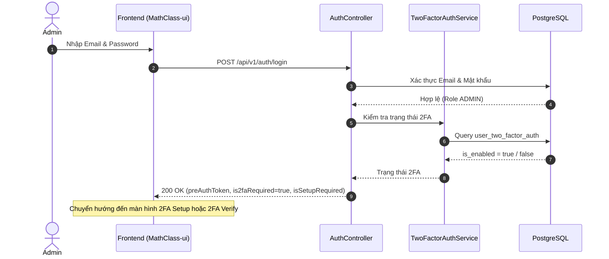
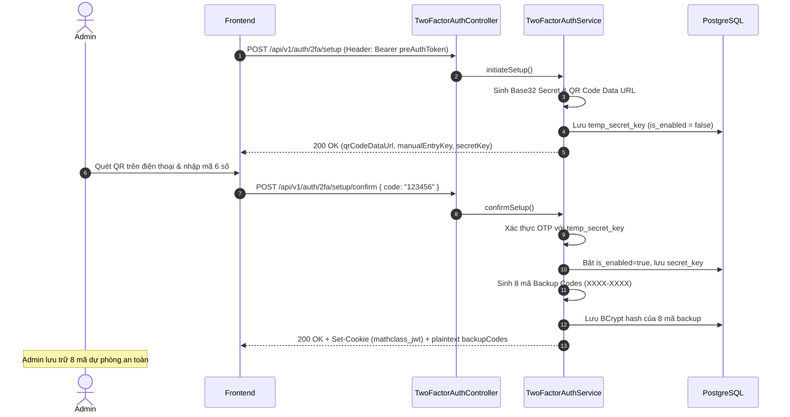

# 🔐 Hướng Dẫn Xác Thực Hai Yếu Tố (2FA - Google Authenticator TOTP)

> **Phân hệ:** `MathClass-service` (Backend)  
> **Đối tượng áp dụng:** Bắt buộc 100% đối với tài khoản Quản trị viên (`ADMIN`).  
> **Tiêu chuẩn:** TOTP (RFC 6238), HMAC-SHA1, Base32 Secret Key, 8 Backup Codes (dùng 1 lần).

---

## 📌 Mục Lục

1. [Tổng Quan & Mục Tiêu Nghiệp Vụ](#1-tổng-quan--mục-tiêu-nghiệp-vụ)
2. [Kiến Trúc Bảo Mật & Các Luồng Hoạt Động (Flows)](#2-kiến-trúc-bảo-mật--các-luồng-hoạt-động-flows)
   - [2.1. Luồng 1: Đăng nhập & Đánh chặn Pre-Auth (Login Interception)](#21-luồng-1-đăng-nhập--đánh-chặn-pre-auth-login-interception)
   - [2.2. Luồng 2: Khởi tạo & Kích hoạt 2FA Lần Đầu (Setup & Confirm)](#22-luồng-2-khởi-tạo--kích-hoạt-2fa-lần-đầu-setup--confirm)
   - [2.3. Luồng 3: Xác thực 2FA Định Kỳ & Mã Dự Phòng (Verify Login)](#23-luồng-3-xác-thực-2fa-định-kỳ--mã-dự-phòng-verify-login)
3. [Mô Hình Dữ Liệu (Database Schema)](#3-mô-hình-dữ-liệu-database-schema)
4. [Các Cơ Chế Phòng Vệ An Ninh (Security Hardening)](#4-các-cơ-chế-phòng-vệ-an-ninh-security-hardening)
5. [Chi Tiết Đặc Tả REST APIs](#5-chi-tiết-đặc-tả-rest-apis)
6. [Hướng Dẫn Thử Nghiệm & Xử Lý Sự Cố (Troubleshooting)](#6-hướng-dẫn-thử-nghiệm--xử-lý-sự-cố-troubleshooting)

---

## 1. Tổng Quan & Mục Tiêu Nghiệp Vụ

Nhằm bảo vệ tuyệt đối hệ thống và dữ liệu người dùng, toàn bộ tài khoản mang vai trò **Quản trị viên (`ADMIN`)** trong MathClass bắt buộc phải kích hoạt và vượt qua **Xác thực 2 bước (2FA)** trước khi được cấp quyền truy cập các tài nguyên quản trị.

### Các nguyên tắc cốt lõi:
- **Chuẩn công nghiệp TOTP (RFC 6238):** Tương thích hoàn toàn với các ứng dụng sinh mã OTP chuẩn như Google Authenticator, Microsoft Authenticator, Authy, 1Password.
- **Pre-Auth Token Architecture:** Tuyệt đối không cấp Access Token, Refresh Token hay Cookie phiên chính thức ở bước nhập mật khẩu nếu tài khoản là Admin.
- **Mã dự phòng (Backup Codes):** Sinh 8 mã dự phòng dùng 1 lần (định dạng `XXXX-XXXX`) khi cài đặt ban đầu nhằm hỗ trợ Admin đăng nhập khẩn cấp khi mất thiết bị.
- **Bảo mật dữ liệu:** Secret key và mã dự phòng được mã hóa/băm một chiều bằng BCrypt trong cơ sở dữ liệu.

---

## 2. Kiến Trúc Bảo Mật & Các Luồng Hoạt Động (Flows)

### 2.1. Luồng 1: Đăng nhập & Đánh chặn Pre-Auth (Login Interception)

Khi Admin gửi yêu cầu `POST /api/v1/auth/login` với email và mật khẩu chính xác:
1. Backend kiểm tra tài khoản có vai trò `ADMIN`.
2. Hệ thống **KHÔNG cấp JWT Cookie hay Refresh Token**.
3. Backend sinh một **`preAuthToken`** (JWT tạm thời có thời hạn 5 phút, mang claim `scope: "PRE_AUTH"`).
4. Phản hồi trả về `is2faRequired: true`, kèm cờ `isSetupRequired` (cho biết Admin đã kích hoạt 2FA trước đó hay chưa).
5. `AuthTokenFilter` sẽ chặn mọi yêu cầu gọi API thông thường hoặc API quản trị nếu token mang scope `PRE_AUTH`, ngoại trừ các endpoint thuộc `/api/v1/auth/2fa/**`.



---

### 2.2. Luồng 2: Khởi tạo & Kích hoạt 2FA Lần Đầu (Setup & Confirm)

Dành cho tài khoản Admin đăng nhập lần đầu tiên (`isSetupRequired: true`):

1. **Khởi tạo (`POST /api/v1/auth/2fa/setup`):**
   - Header: `Authorization: Bearer <preAuthToken>`.
   - Backend sinh Secret Key Base32 ngẫu nhiên (160-bit).
   - Lưu vào cột `temp_secret_key` trong bảng `user_two_factor_auth` (chưa kích hoạt `is_enabled = false` để tránh trạng thái thiết lập dở dang).
   - Tạo mã QR Code dạng Data URL Base64 (`data:image/png;base64,...`) chứa URI chuẩn `otpauth://totp/MathClass:{email}?secret={secret}&issuer=MathClass`.
2. **Xác nhận kích hoạt (`POST /api/v1/auth/2fa/setup/confirm`):**
   - Admin quét mã QR bằng Google Authenticator và gửi mã OTP 6 số đầu tiên.
   - Backend xác thực mã với `temp_secret_key`.
   - Khi hợp lệ:
     - Chuyển `temp_secret_key` sang `secret_key`, xóa `temp_secret_key`, đặt `is_enabled = true` và `enabled_at = NOW()`.
     - Sinh **8 mã dự phòng (Backup Codes)** ngẫu nhiên (8 ký tự `XXXX-XXXX`).
     - Băm toàn bộ mã dự phòng bằng BCrypt và lưu vào bảng `user_backup_codes`.
     - Trả về danh sách 8 mã dự phòng dạng plaintext (chỉ hiển thị **1 lần duy nhất**).
     - Cấp Cookie JWT chính thức (`mathclass_jwt`), Refresh Token và hoàn tất đăng nhập.



---

### 2.3. Luồng 3: Xác thực 2FA Định Kỳ & Mã Dự Phòng (Verify Login)

Dành cho Admin đã kích hoạt 2FA (`isSetupRequired: false`):

1. Admin gửi mã OTP 6 số từ Google Authenticator hoặc mã dự phòng qua `POST /api/v1/auth/2fa/verify`.
2. Header: `Authorization: Bearer <preAuthToken>`.
3. **Nếu `isBackupCode = false` (Mã TOTP 6 số):**
   - Backend lấy `secret_key` từ DB.
   - Xác minh mã theo thuật toán RFC 6238 kèm dung sai lệch thời gian $\pm 1$ bước (30 giây).
   - Kiểm tra chống Replay Attack (từ chối nếu mã đã được xác thực thành công trong vòng 60 giây trước).
4. **Nếu `isBackupCode = true` (Mã dự phòng `XXXX-XXXX`):**
   - Chuẩn hóa chuỗi mã (viết hoa, bỏ dấu gạch ngang nếu có).
   - Tìm kiếm trong danh sách mã backup chưa sử dụng (`is_used = false`) của user.
   - Khớp mã với hash BCrypt.
   - Đánh dấu mã đã sử dụng: `is_used = true`, `used_at = NOW()`.
5. **Xử lý đăng nhập thành công:**
   - Reset số lần nhập sai `failed_attempts = 0`.
   - Cấp Cookie JWT (`mathclass_jwt`), Refresh Token và trả về thông tin `UserInfoResponse`.

---

## 3. Mô Hình Dữ Liệu (Database Schema)

Hệ thống 2FA sử dụng 2 bảng trong PostgreSQL 16 (kế thừa `BaseEntity` gồm `created_at`, `updated_at`):

### 3.1. Bảng `user_two_factor_auth` (Quan hệ 1 - 1 với `users`)

| Tên Cột | Kiểu Dữ Liệu | Ràng Buộc | Ý Nghĩa |
| :--- | :--- | :--- | :--- |
| `user_id` | `BIGINT` | `PK`, `FK users(id) ON DELETE CASCADE` | ID người dùng quản trị |
| `is_enabled` | `BOOLEAN` | `NOT NULL DEFAULT FALSE` | Trạng thái kích hoạt 2FA |
| `secret_key` | `VARCHAR(255)` | `NULLABLE` | Khóa bí mật TOTP chính thức (Base32) |
| `temp_secret_key` | `VARCHAR(255)` | `NULLABLE` | Khóa bí mật tạm thời khi đang quét QR |
| `enabled_at` | `TIMESTAMP` | `NULLABLE` | Thời điểm kích hoạt 2FA thành công |
| `failed_attempts` | `INT` | `NOT NULL DEFAULT 0` | Số lần nhập sai mã liên tiếp |
| `locked_until` | `TIMESTAMP` | `NULLABLE` | Thời điểm mở khóa nếu bị tạm khóa do nhập sai nhiều lần |

### 3.2. Bảng `user_backup_codes` (Quan hệ 1 - N với `users`)

| Tên Cột | Kiểu Dữ Liệu | Ràng Buộc | Ý Nghĩa |
| :--- | :--- | :--- | :--- |
| `id` | `BIGSERIAL` | `PRIMARY KEY` | Khóa chính tự tăng |
| `user_id` | `BIGINT` | `NOT NULL`, `FK users(id) ON DELETE CASCADE` | ID người dùng sở hữu mã |
| `code_hash` | `VARCHAR(100)` | `NOT NULL` | Chuỗi mã băm một chiều (BCrypt) |
| `is_used` | `BOOLEAN` | `NOT NULL DEFAULT FALSE` | Cờ trạng thái đã sử dụng hay chưa |
| `used_at` | `TIMESTAMP` | `NULLABLE` | Thời điểm mã dự phòng được dùng |

> **Index:** `CREATE INDEX idx_user_backup_codes_user_id ON user_backup_codes(user_id);`

---

## 4. Các Cơ Chế Phòng Vệ An Ninh (Security Hardening)

| Nguy Cơ / Lỗ Hổng | Cơ Chế Khắc Phục (Mitigation) |
| :--- | :--- |
| **Bỏ qua 2FA bằng API trực tiếp** | Không cấp Cookie JWT hoặc Refresh Token ở bước mật khẩu. `AuthTokenFilter` chặn tất cả API nếu token có scope `PRE_AUTH`. |
| **Thiết lập 2FA dở dang** | Tách biệt `temp_secret_key` và `secret_key`. Chỉ cập nhật khóa chính khi xác nhận mã OTP đầu tiên thành công. |
| **Rò rỉ Database lộ mã dự phòng** | Mã dự phòng được băm bằng **BCrypt** trước khi ghi vào DB. Chỉ hiển thị plaintext duy nhất 1 lần khi kích hoạt. |
| **Lệch đồng hồ (Clock Drift)** | TOTP Validator hỗ trợ kiểm tra khung thời gian **$\pm 1$ time-step (30 giây)** quanh thời điểm hiện tại. |
| **Tấn công phát lại mã (Replay Attack)** | Bộ nhớ Cache (60 giây) lưu hash mã vừa xác thực thành công; từ chối nếu nhận lại cùng mã trong cùng chu kỳ. |
| **Tấn công dò mã (Brute-force)** | Giới hạn tối đa **5 lần nhập sai liên tiếp**. Vượt quá 5 lần sẽ khóa xác thực 2FA trong **15 phút** (`429 Too Many Requests`). |
| **Mã dự phòng dùng nhiều lần** | Mỗi mã dự phòng có tính nguyên tử (`@Transactional`), ngay khi khớp thành công sẽ chuyển `is_used = true` và không thể tái sử dụng. |

---

## 5. Chi Tiết Đặc Tả REST APIs

Base URL: `http://localhost:8080/api/v1`

### 5.1. Khởi tạo Thiết lập 2FA
- **Endpoint:** `POST /api/v1/auth/2fa/setup`
- **Quyền truy cập:** Header `Authorization: Bearer <preAuthToken>`
- **Response `200 OK`:**
```json
{
  "secretKey": "JBSWY3DPEHPK3PXP",
  "qrCodeDataUrl": "data:image/png;base64,iVBORw0KGgoAAAANSUhEUgAAAMgAAADIAQMAAACFiAbKAAAABlBMVEUAAAD///+l2Z/dAAAACXBIWXMAAA7EAAAOxAGVKw4b...",
  "manualEntryKey": "JBSW Y3DP EHPK 3PXP"
}
```

### 5.2. Xác nhận Kích hoạt & Cấp Backup Codes
- **Endpoint:** `POST /api/v1/auth/2fa/setup/confirm`
- **Quyền truy cập:** Header `Authorization: Bearer <preAuthToken>`
- **Request Body:**
```json
{
  "code": "528194"
}
```
- **Response `200 OK` (Set-Cookie: `mathclass_jwt=...`):**
```json
{
  "userInfo": {
    "id": 1,
    "email": "admin@mathclass.com",
    "fullName": "System Administrator",
    "role": "ADMIN"
  },
  "backupCodes": [
    "A1B2-C3D4",
    "E5F6-G7H8",
    "I9J0-K1L2",
    "M3N4-O5P6",
    "Q7R8-S9T0",
    "U1V2-W3X4",
    "Y5Z6-A7B8",
    "C9D0-E1F2"
  ],
  "message": "Kích hoạt xác thực 2 bước thành công!"
}
```

### 5.3. Xác thực Đăng nhập Định kỳ
- **Endpoint:** `POST /api/v1/auth/2fa/verify`
- **Quyền truy cập:** Header `Authorization: Bearer <preAuthToken>`
- **Request Body (Khi dùng App Authenticator):**
```json
{
  "code": "528194",
  "isBackupCode": false
}
```
- **Request Body (Khi dùng Mã Dự Phòng):**
```json
{
  "code": "A1B2-C3D4",
  "isBackupCode": true
}
```
- **Response `200 OK` (Set-Cookie: `mathclass_jwt=...`):**
```json
{
  "id": 1,
  "email": "admin@mathclass.com",
  "fullName": "System Administrator",
  "role": "ADMIN",
  "token": "eyJhbGciOiJIUzI1NiIsInR5cCI6IkpXVCJ9..."
}
```

---

## 6. Hướng Dẫn Thử Nghiệm & Xử Lý Sự Cố (Troubleshooting)

### 6.1. Kiểm thử trên Swagger UI
1. Mở `http://localhost:8080/swagger-ui.html`.
2. Gọi `POST /api/v1/auth/login` với thông tin tài khoản Admin.
3. Sao chép chuỗi `preAuthToken` từ response.
4. Bấm **Authorize** trên góc phải Swagger, dán token dạng `Bearer <preAuthToken>`.
5. Gọi `POST /api/v1/auth/2fa/setup` để lấy chuỗi Data URL của ảnh QR Code.
6. Mở trình duyệt dán chuỗi Data URL để quét mã QR bằng điện thoại.
7. Gọi `POST /api/v1/auth/2fa/setup/confirm` với mã 6 số từ Google Authenticator để hoàn tất kích hoạt.

### 6.2. Quy trình Khôi phục Khẩn cấp (Khi Admin mất thiết bị và hết mã backup)
Trong trường hợp khẩn cấp khi Quản trị viên mất toàn bộ thiết bị và mã dự phòng, can thiệp trực tiếp vào database để đặt lại trạng thái 2FA cho tài khoản:

```sql
-- 1. Xóa các mã dự phòng cũ của admin
DELETE FROM user_backup_codes WHERE user_id = <ADMIN_USER_ID>;

-- 2. Tắt trạng thái 2FA và xóa secret key cũ
UPDATE user_two_factor_auth 
SET is_enabled = FALSE, 
    secret_key = NULL, 
    temp_secret_key = NULL, 
    failed_attempts = 0, 
    locked_until = NULL, 
    updated_at = NOW()
WHERE user_id = <ADMIN_USER_ID>;
```

Sau khi chạy lệnh SQL trên, ở lần đăng nhập tiếp theo, hệ thống sẽ tự động yêu cầu Quản trị viên thiết lập lại mã QR 2FA mới từ đầu.
