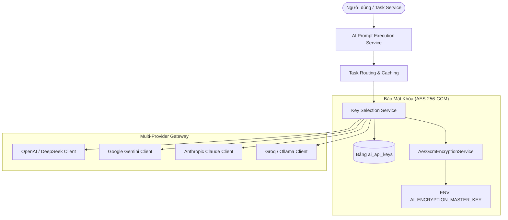
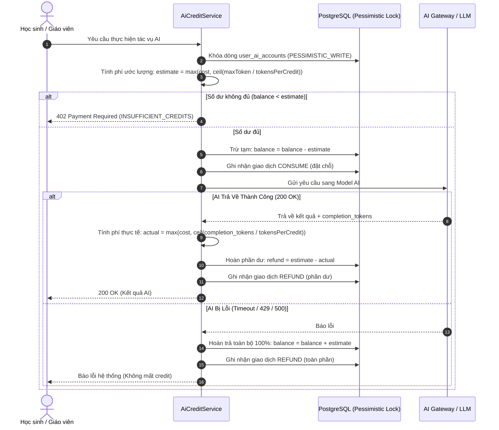

# 🤖 Hướng Dẫn Kiến Trúc Hệ Thống AI (AI Subsystem & Credit Quota Guide)

> **Phân hệ:** `MathClass-service` (Backend)  
> **Áp dụng cho:** Quản trị viên (`ADMIN`), Giáo viên (`TEACHER`), Học sinh (`STUDENT`).  
> **Cụm tính năng:** Multi-Provider Gateway, Quản lý Khóa API AES-256, Task Routing, System Prompts Versioning, Sổ Cái Credit (Reserve-then-Refund), và Bộ Công Cụ AI Toán Học.

---

## 📌 Mục Lục

1. [Tổng Quan & Mục Tiêu Nghiệp Vụ](#1-tổng-quan--mục-tiêu-nghiệp-vụ)
2. [Kiến Trúc Multi-Provider & Bảo Mật Khóa API](#2-kiến-trúc-multi-provider--bảo-mật-khóa-api)
   - [2.1. Mã hóa AES-256-GCM & 12-Factor App](#21-mã-hóa-aes-256-gcm--12-factor-app)
   - [2.2. Kiểm tra Kết Nối 2 Bước (Two-Step Verification)](#22-kiểm-tra-kết-nối-2-bước-two-step-verification)
   - [2.3. Chiến Lược Xoay Khóa & Tự Phục Hồi (Failover & Self-Healing)](#23-chiến-lược-xoay-khóa--tự-phục-hồi-failover--self-healing)
3. [Định Tuyến Tác Vụ Động (Dynamic Task Routing)](#3-định-tuyến-tác-vụ-động-dynamic-task-routing)
4. [Quản Lý Câu Lệnh Mẫu & Lịch Sử Phiên Bản (System Prompt Versioning)](#4-quản-lý-câu-lệnh-mẫu--lịch-sử-phiên-bản-system-prompt-versioning)
5. [Hệ Thống AI Credit & Sổ Cái Giao Dịch (Credit Quota Ledger)](#5-hệ-thống-ai-credit--sổ-cái-giao-dịch-credit-quota-ledger)
   - [5.1. Cơ Chế Tính Phí Reserve-then-Refund](#51-cơ-chế-tính-phí-reserve-then-refund)
   - [5.2. Khóa Bi Quan (Pessimistic Locking) Chống Double-Spend](#52-khóa-bi-quan-pessimistic-locking-chống-double-spend)
   - [5.3. Sổ Cái Giao Dịch Bất Biến & Xử Lý Mã Lỗi HTTP 402](#53-sổ-cái-giao-dịch-bất-biến--xử-lý-mã-lỗi-http-402)
6. [Bộ Công Cụ AI Chuyên Sâu Môn Toán (Math AI Services)](#6-bộ-công-cụ-ai-chuyên-sâu-môn-toán-math-ai-services)
   - [6.1. Sinh Đề Bài Toán Học (AI Question Generator)](#61-sinh-đề-bài-toán-học-ai-question-generator)
   - [6.2. Gợi Ý Tư Duy Giải Toán (AI Student Hints)](#62-gợi-ý-tư-duy-giải-toán-ai-student-hints)
   - [6.3. Nhận Diện Chữ Viết Tay Toán Học (Canvas OCR)](#63-nhận-diện-chữ-viết-tay-toán-học-canvas-ocr)
   - [6.4. Chấm Điểm Bài Nộp Tự Động (AI Automated Grading)](#64-chấm-điểm-bài-nộp-tự-động-ai-automated-grading)
7. [Mô Hình Dữ Liệu PostgreSQL (Database Schema)](#7-mô-hình-dữ-liệu-postgresql-database-schema)
8. [Chi Tiết Đặc Tả REST APIs Cụm AI](#8-chi-tiết-đặc-tả-rest-apis-cụm-ai)

---

## 1. Tổng Quan & Mục Tiêu Nghiệp Vụ

Hệ thống **AI Subsystem** trong MathClass là một cổng tích hợp AI đa nhà cung cấp (**Multi-Provider AI Gateway**) được thiết kế chuyên biệt cho giáo dục Toán học:
- **Tối ưu chi phí & độ trễ:** Cho phép gán từng mô hình AI phù hợp (Gemini Flash, GPT-4o-mini, Claude Sonnet, DeepSeek...) cho từng tác vụ riêng biệt.
- **Bảo mật cấp doanh nghiệp:** Không lộ API Key dạng Plaintext ở bất kỳ đâu (mã hóa chuẩn AES-256-GCM trong DB, che mờ Key trên UI).
- **Kiểm soát hạn ngạch chặt chẽ:** Quản lý credit cá nhân hóa cho từng học sinh/giáo viên với cơ chế khóa bi quan chống chi tiêu vượt mức (Double-Spend).
- **Hỗ trợ tối đa giảng dạy và học tập Toán:** Tự động sinh công thức LaTeX, tạo dữ liệu đồ thị/hình học cho JSXGraph Canvas, nhận diện chữ viết tay và gợi ý tư duy từng bước.

---

## 2. Kiến Trúc Multi-Provider & Bảo Mật Khóa API



### 2.1. Mã hóa AES-256-GCM & Quản lý Khóa Bí Mật (Infisical Secret Management)
- Mọi API Key khi được Admin nhập vào hệ thống đều phải đi qua `AesGcmEncryptionService` (hoặc `EncryptionService`) để mã hóa bằng thuật toán **AES-256-GCM** trước khi lưu vào cột `encrypted_api_key` trong bảng `ai_api_keys`.
- **Lưu trữ Khóa Chủ (Master Key) qua Infisical:** Khóa bí mật gốc 256-bit được quản lý tập trung và nạp an toàn từ nền tảng **Infisical Secret Management** qua cơ chế Universal Auth khi khởi động ứng dụng (với `EnvVarMasterKeyProvider` làm fallback cho môi trường local offline). Chi tiết xem tại [Hướng dẫn Sử dụng Infisical (08-infisical-secrets-guide.md)](08-infisical-secrets-guide.md).
- Khi trả dữ liệu ra Frontend qua REST API, toàn bộ Key được che mờ (chỉ hiển thị 8 ký tự đầu + `***` + 4 ký tự cuối, ví dụ: `AIzaSyD8***x9K4`).

### 2.2. Kiểm tra Kết Nối 2 Bước (Two-Step Verification)
Để đảm bảo API Key luôn hoạt động chính xác trước khi đưa vào luồng chính:
1. **Bước 1 (List Models API):** Gửi yêu cầu lấy danh sách models từ Provider để xác thực tính hợp lệ của Key (bắt lỗi `401 Unauthorized`).
2. **Bước 2 (Lightweight Prompt API):** Gửi một prompt 1-token siêu nhẹ để xác thực Quota/Credits (bắt lỗi `429 Too Many Requests`) và quyền truy cập Model (bắt lỗi `403/404`), đồng thời đo độ trễ phản hồi (Latency ms).

### 2.3. Chiến Lược Xoay Khóa & Tự Phục Hồi (Failover & Self-Healing)
- **`PRIORITY_FAILOVER`:** Luôn ưu tiên dùng Key có `priority` cao nhất đang ở trạng thái `ACTIVE`. Khi gặp lỗi `429` (hết quota) hoặc `401` (khóa hỏng), hệ thống tự động đổi trạng thái sang `EXHAUSTED_QUOTA` hoặc `INVALID` và chuyển ngay sang Key tiếp theo.
- **`ROUND_ROBIN`:** Phân bổ luân phiên các Active Keys để chia đều lưu lượng.
- **Tự phục hồi (Self-Healing):** Các Key bị chuyển sang `EXHAUSTED_QUOTA` có cơ chế tự động phục hồi về `ACTIVE` sau **1 giờ** (TTL 1 hour). Admin cũng có thể bấm *"Reset Status"* thủ công sau khi chạy quy trình Test Connection thành công.
- **Fallback Provider:** Nếu toàn bộ Key của Provider chính cạn kiệt, hệ thống tự động chuyển sang Provider dự phòng (`fallback_provider_id`) đã được cấu hình cho Task.

---

## 3. Định Tuyến Tác Vụ Động (Dynamic Task Routing)

Hệ thống phân tách rõ ràng cấu hình cho từng tác vụ AI trong bảng `ai_task_configs`:

| Task Code | Tên Tác Vụ | Chi Phí Mặc Định | Model Khuyến Nghị | Mô Tả |
| :--- | :--- | :--- | :--- | :--- |
| `QUESTION_GEN` | Sinh đề bài Toán | 3 Credits | `gemini-1.5-pro` / `gpt-4o` | Sinh đề toán LaTeX + đồ thị JSXGraph |
| `STUDENT_HINT` | Gợi ý tư duy | 1 Credit | `gemini-1.5-flash` / `gpt-4o-mini` | Gợi ý từng bước không lộ đáp án |
| `CANVAS_LATEX` | Chuyển chữ viết tay → LaTeX | 2 Credits | `gemini-1.5-flash` (Vision) | Nhận diện chữ viết tay qua Canvas |
| `SUBMISSION_GRADING` | Chấm điểm tự động | 5 Credits | `gpt-4o` / `claude-3-5-sonnet` | Chấm bài tự luận và nhận xét |
| `ERROR_ANALYSIS` | Phân tích lỗi sai | 2 Credits | `gemini-1.5-flash` | Phân tích nguyên nhân học sinh làm sai |

> ⚡ **Caffeine Caching:** Cấu hình Task Routing được cache trong bộ nhớ với Caffeine (TTL 10 phút). Khi Admin cập nhật cấu hình trên UI, hệ thống kích hoạt `@CacheEvict` để xóa cache tức thì.

---

## 4. Quản Lý Câu Lệnh Mẫu & Lịch Sử Phiên Bản (System Prompt Versioning)

- **Biến môi trường động (Variables):** Hỗ trợ chèn các biến định dạng `{{grade_level}}`, `{{topic}}`, `{{difficulty}}`, `{{student_answer}}` vào nội dung Prompt.
- **Strict Validation:** Khi Admin chỉnh sửa Prompt, hệ thống kiểm tra nghiêm ngặt chỉ cho phép các biến nằm trong danh sách `allowed_variables` của tác vụ tương ứng.
- **Lịch sử phiên bản (Versioning & History):** Mỗi lần chỉnh sửa thành công, hệ thống tự động lưu bản ghi mới vào bảng `system_prompt_history` với số `version` tăng dần kèm lý do thay đổi (`change_reason`).
- **Khôi phục mặc định (Reset to Default) & Rollback:** Cho phép Admin khôi phục về phiên bản ban đầu của hệ thống (`default_content`) hoặc quay về một phiên bản lịch sử bất kỳ.
- **Xem trước trực tiếp (Live Preview):** Hỗ trợ Admin điền giá trị mẫu cho các biến và xem kết quả Prompt hoàn chỉnh trước khi lưu.

---

## 5. Hệ Thống AI Credit & Sổ Cái Giao Dịch (Credit Quota Ledger)

### 5.1. Cơ Chế Tính Phí Reserve-then-Refund

Để đảm bảo người dùng không bị trừ oan credit khi AI gặp sự cố kỹ thuật và hệ thống không bị thâm hụt số dư:



### 5.2. Khóa Bi Quan (Pessimistic Locking) Chống Double-Spend
- Để ngăn chặn việc người dùng mở nhiều tab hoặc chạy script gửi song song nhiều yêu cầu khi chỉ còn ít credit, phương thức trừ credit sử dụng `@Lock(LockModeType.PESSIMISTIC_WRITE)` trên bảng `user_ai_accounts`.
- Mọi giao dịch biến động số dư đều được thực thi trong một `@Transactional` độc lập.

### 5.3. Sổ Cái Giao Dịch Bất Biến & Xử Lý Mã Lỗi HTTP 402
- **Sổ cái bất biến (`credit_transactions`):** Lưu trữ toàn bộ lịch sử biến động số dư với các loại giao dịch:
  - `GRANT_DEFAULT`: Cấp hạn mức ban đầu khi tạo tài khoản hoặc nạp hạn ngạch miễn phí hàng ngày.
  - `PURCHASE`: Mua thêm gói credit qua cổng nạp.
  - `ADMIN_ADJUST`: Quản trị viên điều chỉnh thủ công (cộng/trừ kèm lý do).
  - `CONSUME`: Khấu trừ credit khi gọi AI.
  - `REFUND`: Hoàn lại credit khi AI lỗi hoặc hoàn phần dư token.
- **Mã lỗi chuẩn `402 Payment Required`:** Khi hết credit, API trả về HTTP Status `402` với `errorCode = "INSUFFICIENT_CREDITS"`. Frontend bắt mã lỗi này để hiển thị modal hướng dẫn nạp thêm credit mà không gây hiểu lầm là lỗi server (500) hay lỗi quá tải (429).

---

## 6. Bộ Công Cụ AI Chuyên Sâu Môn Toán (Math AI Services)

### 6.1. Sinh Đề Bài Toán Học (AI Question Generator)
- **Endpoint:** `POST /api/v1/assignments/ai-generate`
- **Đầu vào:** `prompt`, `grade` (Lớp 6-12), `difficulty` (`NHAN_BIET`, `THONG_HIEU`, `VAN_DUNG`, `VAN_DUNG_CAO`), `topic`, `questionType` (`ESSAY`, `MULTIPLE_CHOICE`), `includeCanvasDiagram` (boolean).
- **Đầu ra cấu trúc:**
  - `content`: Đề bài chuẩn LaTeX KaTeX kẹp trong `$...$` hoặc `$$...$$`.
  - `explanation`: Lời giải chi tiết từng bước.
  - `canvasData`: Cấu trúc JSON chứa danh sách điểm (`points`), đoạn thẳng (`segments`), đường tròn (`circles`), góc (`angles`), và nhãn (`labels`) để Frontend vẽ tự động lên JSXGraph Canvas.

### 6.2. Gợi Ý Tư Duy Giải Toán (AI Student Hints)
- **Endpoint:** `POST /api/v1/submissions/{id}/hints`
- **Nguyên tắc sư phạm:** Cung cấp định hướng tư duy từng bước dựa trên bài làm hiện tại của học sinh, tuyệt đối không giải hộ hoặc trả về đáp án cuối cùng.
- **Giới hạn:** Mỗi học sinh tối đa nhận **3 gợi ý/bài tập** (`MAX_HINTS = 3`).

### 6.3. Nhận Diện Chữ Viết Tay Toán Học (Canvas OCR)
- **Endpoint:** `POST /api/v1/submissions/handwriting-ocr`
- **Cơ chế:** Nhận ảnh chụp nét vẽ Canvas dạng Base64 Data URL, chuyển tới mô hình Vision (Gemini 1.5 Flash) để trích xuất thành chuỗi công thức LaTeX chuẩn.

### 6.4. Chấm Điểm Bài Nộp Tự Động (AI Automated Grading)
- **Endpoint:** `POST /api/v1/submissions/{id}/ai-grade`
- **Cơ chế:** So khớp lời giải của học sinh với đáp án và barem chấm điểm của giáo viên, tự động cho điểm thành phần và xuất nhận xét chi tiết.

---

## 7. Mô Hình Dữ Liệu PostgreSQL (Database Schema)

```sql
-- 1. Bảng Nhà cung cấp AI
CREATE TABLE ai_providers (
    id BIGSERIAL PRIMARY KEY,
    provider_code VARCHAR(50) NOT NULL UNIQUE,
    provider_name VARCHAR(100) NOT NULL,
    base_url VARCHAR(255),
    key_selection_strategy VARCHAR(30) DEFAULT 'PRIORITY_FAILOVER',
    is_active BOOLEAN DEFAULT TRUE,
    created_at TIMESTAMP WITHOUT TIME ZONE DEFAULT CURRENT_TIMESTAMP,
    updated_at TIMESTAMP WITHOUT TIME ZONE DEFAULT CURRENT_TIMESTAMP
);

-- 2. Bảng Khóa API mã hóa AES-256-GCM
CREATE TABLE ai_api_keys (
    id BIGSERIAL PRIMARY KEY,
    provider_id BIGINT NOT NULL REFERENCES ai_providers(id) ON DELETE CASCADE,
    key_name VARCHAR(100) NOT NULL,
    encrypted_api_key TEXT NOT NULL,
    status VARCHAR(30) DEFAULT 'ACTIVE',
    priority INT DEFAULT 1,
    is_active BOOLEAN DEFAULT TRUE,
    last_used_at TIMESTAMP,
    created_at TIMESTAMP WITHOUT TIME ZONE DEFAULT CURRENT_TIMESTAMP,
    updated_at TIMESTAMP WITHOUT TIME ZONE DEFAULT CURRENT_TIMESTAMP
);

-- 3. Bảng Định tuyến Tác vụ (Task Routing)
CREATE TABLE ai_task_configs (
    id BIGSERIAL PRIMARY KEY,
    task_code VARCHAR(50) NOT NULL UNIQUE,
    task_name VARCHAR(100) NOT NULL,
    provider_id BIGINT NOT NULL REFERENCES ai_providers(id),
    fallback_provider_id BIGINT REFERENCES ai_providers(id),
    model_name VARCHAR(100) NOT NULL,
    temperature DOUBLE PRECISION DEFAULT 0.7,
    max_tokens INTEGER DEFAULT 2048,
    cost_per_call INT DEFAULT 1,
    tokens_per_credit INT DEFAULT 1000,
    is_enabled BOOLEAN DEFAULT TRUE,
    created_at TIMESTAMP WITHOUT TIME ZONE DEFAULT CURRENT_TIMESTAMP,
    updated_at TIMESTAMP WITHOUT TIME ZONE DEFAULT CURRENT_TIMESTAMP
);

-- 4. Bảng System Prompts
CREATE TABLE ai_system_prompts (
    id BIGSERIAL PRIMARY KEY,
    code VARCHAR(50) NOT NULL UNIQUE,
    name VARCHAR(100) NOT NULL,
    task_code VARCHAR(50) NOT NULL REFERENCES ai_task_configs(task_code),
    current_content TEXT NOT NULL,
    default_content TEXT NOT NULL,
    allowed_variables TEXT,
    description TEXT,
    is_active BOOLEAN DEFAULT TRUE,
    version INT DEFAULT 1,
    created_at TIMESTAMP WITHOUT TIME ZONE DEFAULT CURRENT_TIMESTAMP,
    updated_at TIMESTAMP WITHOUT TIME ZONE DEFAULT CURRENT_TIMESTAMP
);

-- 5. Bảng Lịch sử phiên bản System Prompts
CREATE TABLE system_prompt_history (
    id BIGSERIAL PRIMARY KEY,
    prompt_id BIGINT NOT NULL REFERENCES ai_system_prompts(id) ON DELETE CASCADE,
    version INT NOT NULL,
    content TEXT NOT NULL,
    change_reason VARCHAR(255),
    created_by BIGINT,
    created_at TIMESTAMP WITHOUT TIME ZONE DEFAULT CURRENT_TIMESTAMP
);

-- 6. Bảng Tài khoản Credit người dùng
CREATE TABLE user_ai_accounts (
    id BIGSERIAL PRIMARY KEY,
    user_id BIGINT NOT NULL UNIQUE REFERENCES users(id) ON DELETE CASCADE,
    balance INT NOT NULL DEFAULT 0,
    total_earned INT NOT NULL DEFAULT 0,
    total_spent INT NOT NULL DEFAULT 0,
    created_at TIMESTAMP WITHOUT TIME ZONE DEFAULT CURRENT_TIMESTAMP,
    updated_at TIMESTAMP WITHOUT TIME ZONE DEFAULT CURRENT_TIMESTAMP
);

-- 7. Sổ cái giao dịch Credit (Bất biến)
CREATE TABLE credit_transactions (
    id BIGSERIAL PRIMARY KEY,
    user_id BIGINT NOT NULL REFERENCES users(id) ON DELETE CASCADE,
    amount INT NOT NULL,
    balance_after INT NOT NULL,
    transaction_type VARCHAR(30) NOT NULL,
    task_code VARCHAR(50),
    description TEXT,
    created_at TIMESTAMP WITHOUT TIME ZONE DEFAULT CURRENT_TIMESTAMP
);
CREATE INDEX idx_credit_trans_user ON credit_transactions(user_id);
```

---

## 8. Chi Tiết Đặc Tả REST APIs Cụm AI

Base URL: `http://localhost:8080/api/v1`

### 8.1. Nhóm API Quản Trị Cấu Hình AI (`ADMIN`)
| Method | Endpoint | Mô Tả |
| :--- | :--- | :--- |
| `GET` | `/api/v1/providers` | Danh sách các AI Providers |
| `POST` | `/api/v1/providers` | Thêm mới AI Provider |
| `POST` | `/api/v1/providers/test` | Kiểm tra kết nối 2 bước tới Provider (List Models & Latency Prompt) |
| `GET` | `/api/v1/providers/{id}/keys` | Danh sách API Keys của Provider (Key đã được che mờ) |
| `POST` | `/api/v1/providers/{id}/keys` | Thêm mới API Key (Mã hóa AES-256-GCM) |
| `POST` | `/api/v1/keys/{id}/verify` | Xác thực tính hợp lệ của API Key cụ thể |
| `GET` | `/api/v1/tasks/{task}` | Xem cấu hình Task Routing của một tác vụ |
| `PUT` | `/api/v1/tasks/{task}` | Cập nhật Model, Temperature, MaxTokens, Provider cho tác vụ |
| `GET` | `/api/v1/admin/ai/prompts` | Danh sách các System Prompts |
| `PUT` | `/api/v1/admin/ai/prompts/{id}` | Cập nhật nội dung Prompt (Tự động tăng version) |
| `POST` | `/api/v1/admin/ai/prompts/preview` | Render xem trước Prompt với dữ liệu mẫu |
| `POST` | `/api/v1/admin/ai/prompts/{id}/reset` | Khôi phục Prompt về nội dung mặc định gốc |

### 8.2. Nhóm API Quản Trị & Sử Dụng AI Credit
| Method | Endpoint | Quyền | Mô Tả |
| :--- | :--- | :--- | :--- |
| `GET` | `/api/v1/credits/balance` | Authenticated | Xem số dư credit cá nhân và hạn ngạch miễn phí hôm nay |
| `GET` | `/api/v1/credits/ledger` | Authenticated | Xem lịch sử giao dịch credit cá nhân (phân trang server-side) |
| `GET` | `/api/v1/credits/packages` | Authenticated | Danh sách các gói nạp credit khả dụng |
| `GET` | `/api/v1/admin/credits/config` | `ADMIN` | Xem cấu hình cấp credit mặc định & hạn ngạch toàn hệ thống |
| `PUT` | `/api/v1/admin/credits/config` | `ADMIN` | Cập nhật hạn mức credit mặc định theo role |
| `POST` | `/api/v1/admin/credits/adjust` | `ADMIN` | Điều chỉnh credit thủ công cho người dùng (cộng/trừ) |

### 8.3. Nhóm API Tính Năng Toán Học AI
| Method | Endpoint | Quyền | Mô Tả |
| :--- | :--- | :--- | :--- |
| `POST` | `/api/v1/assignments/ai-generate` | `TEACHER` | Sinh đề bài toán học tự động (LaTeX + JSXGraph) |
| `POST` | `/api/v1/submissions/{id}/hints` | `STUDENT` | Yêu cầu gợi ý giải toán từng bước (tối đa 3 lần/bài) |
| `POST` | `/api/v1/submissions/handwriting-ocr` | Authenticated | Nhận diện công thức chữ viết tay từ Canvas thành LaTeX |
| `POST` | `/api/v1/submissions/{id}/ai-grade` | `TEACHER` | Chấm điểm và đưa ra nhận xét tự động cho bài nộp |
