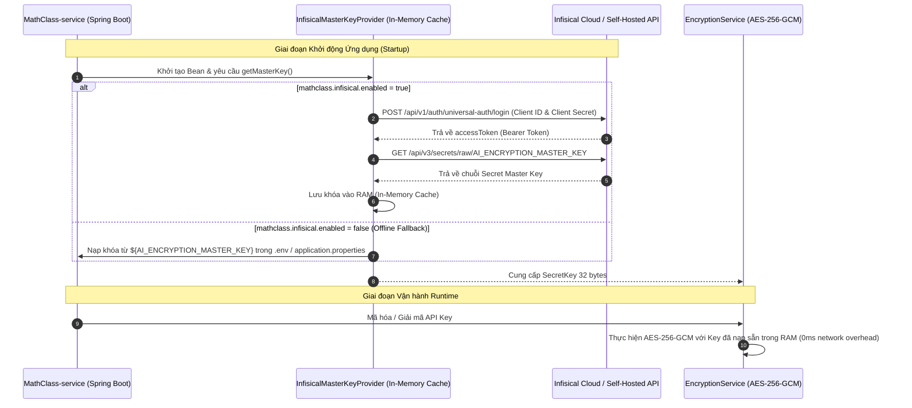
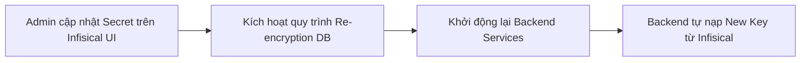

# 🔐 Hướng Dẫn Sử Dụng Infisical Secret Management (MAT-289)

> **Tài liệu hướng dẫn:** Quản lý và Lưu trữ Bí mật Khóa Mã Hóa AI API Key qua Dịch vụ Bên Thứ Ba (Infisical).  
> **Dành cho:** Tất cả các thành viên trong đội ngũ phát triển (Developers, DevOps, Quản trị viên).  
> **Áp dụng tại:** `MathClass-service` (Spring Boot Backend).

---

## 📌 Mục Lục

1. [Tổng Quan & Lý Do Sử Dụng](#1-tổng-quan--lý-do-sử-dụng)
2. [Kiến Trúc & Cơ Chế Hoạt Động](#2-kiến-trúc--cơ-chế-hoạt-động)
3. [Hướng Dẫn Cấu Hình Từng Bước Cho Thành Viên](#3-hướng-dẫn-cấu-hình-từng-bước-cho-thành-viên)
   - [3.1. Chế độ Local Offline Development (Mặc định)](#31-chế-độ-local-offline-development-mặc-định)
   - [3.2. Chế độ Tích Hợp Trực Tiếp Infisical (Cloud / Staging / Production)](#32-chế-độ-tích-hợp-trực-tiếp-infisical-cloud--staging--production)
4. [Bảng Tham Số Biến Môi Trường (Environment Variables)](#4-bảng-tham-số-biến-môi-trường-environment-variables)
5. [Quy Trình Quản Lý & Xoay Khóa (Secret Rotation)](#5-quy-trình-quản-lý--xoay-khóa-secret-rotation)
6. [Xử Lý Sự Cố Thường Gặp (Troubleshooting & FAQs)](#6-xử-lý-sự-cố-thường-gặp-troubleshooting--faqs)

---

## 1. Tổng Quan & Lý Do Sử Dụng

Trong phân hệ **AI Gateway** của MathClass, các API Key của nhà cung cấp bên ngoài (OpenAI, Google Gemini, Anthropic...) được mã hóa bằng thuật toán **AES-256-GCM** trước khi lưu vào cơ sở dữ liệu PostgreSQL.

Để thực hiện mã hóa và giải mã, hệ thống cần một **Master Secret Key (Khóa chủ)** 256-bit (32 bytes).

### ❌ Nhược điểm khi lưu Master Key trong file `.env`

- Dễ bị rò rỉ khi chia sẻ file cấu hình qua email, chat hoặc vô tình commit vào git.
- Khó đồng bộ và cập nhật đồng nhất giữa các môi trường (Dev, Staging, Production).
- Không có nhật ký kiểm toán (Audit Logs) để biết ai đã đọc/sửa đổi khóa.
- Không hỗ trợ quy trình xoay khóa tự động (Secret Rotation).

### ✅ Lợi ích khi sử dụng Infisical

- **Tách biệt hoàn toàn Bí mật khỏi Mã nguồn:** Khóa được lưu trữ mã hóa end-to-end trên nền tảng Secret Management chuyên dụng.
- **Xác thực Định danh Máy chủ (Universal Auth):** Máy chủ backend chỉ cần sở hữu cặp thông tin Machine Identity để truy xuất khóa.
- **Kiểm soát Truy cập Dựa trên Vai trò (RBAC):** Phân quyền chi tiết ai được phép đọc/ghi từng Secret.
- **Lịch sử Phiên bản & Audit Logs:** Lưu lại toàn bộ lịch sử thay đổi và phiên truy xuất Secret.

---

## 2. Kiến Trúc & Cơ Chế Hoạt Động



### Điểm nổi bật trong kiến trúc

1. **Không phát sinh độ trễ Runtime (Zero Latency Impact):** Khóa chỉ được kéo về **1 lần duy nhất lúc khởi động** và cache an toàn trong RAM, hoàn toàn không gọi HTTP sang Infisical khi ứng dụng mã hóa/giải mã API Key của người dùng.
2. **Mẫu thiết kế `MasterKeyProvider` linh hoạt:** Tự động fallback về file `.env` nếu tắt tính năng Infisical (`mathclass.infisical.enabled=false`), giúp các thành viên phát triển tính năng khác không bị phụ thuộc kết nối mạng hay bắt buộc phải có tài khoản Infisical.
3. **Tuân thủ Chuẩn Zero Key Exposure:** Tuyệt đối không log, in hoặc xuất Master Key ra console hay file log dưới mọi hình thức.

---

## 3. Hướng Dẫn Cấu Hình Từng Bước Cho Thành Viên

### 3.1. Chế độ Local Offline Development (Mặc định)

Nếu bạn chỉ đang phát triển các tính năng nghiệp vụ thông thường (Classroom, Assignment, Submission, 2FA...) và không cần kết nối tới Infisical Cloud:

1. Mở file `.env` tại thư mục gốc `MathClass-service/`.
2. Đảm bảo cấu hình biến như sau:

   ```properties
   # Tắt kết nối Infisical để dùng Local Secret Key
   INFISICAL_ENABLED=false
   
   # Khóa mã hóa dự phòng cho môi trường local
   AI_ENCRYPTION_MASTER_KEY=MathClassSecretKeyForAiEncryption32B!
   ```

3. Chạy ứng dụng bình thường (`./gradlew bootRun`). Ứng dụng sẽ tự động kích hoạt `EnvVarMasterKeyProvider` và hoạt động hoàn hảo.

---

### 3.2. Chế độ Tích Hợp Trực Tiếp Infisical (Cloud / Staging / Production)

Khi bạn cần chạy thử nghiệm trên môi trường có kết nối Infisical hoặc triển khai Staging/Production:

#### 🔹 Bước 1: Đăng nhập Infisical Console

- Truy cập cổng Infisical của dự án: [https://app.infisical.com](https://app.infisical.com) (hoặc URL Self-hosted của team).
- Đăng nhập bằng tài khoản được Admin mời vào tổ chức.

#### 🔹 Bước 2: Lấy thông tin Project ID & Khởi tạo Machine Identity

1. Chọn Project **MathClass**.
2. Vào mục **Project Settings** ➔ **General** ➔ Copy giá trị **Project ID** (hoặc **Workspace ID**).
3. Vào mục **Access Control** (hoặc **Machine Identities**) ➔ Chọn **Add Machine Identity**:
   - Tên: `mathclass-backend-dev` (hoặc tên theo môi trường của bạn).
   - Quyền hạn (Role): Gán quyền `Viewer` / `Read-Only` đối với Secret Path `/` trên môi trường `dev`.
4. Sau khi tạo, bấm **Create Universal Auth Credentials** để nhận:
   - **Client ID** (ví dụ: `c0a801...`)
   - **Client Secret** (ví dụ: `inf_sec_...`)
   *(⚠️ Lưu ý: Client Secret chỉ hiển thị một lần duy nhất, hãy sao lưu cẩn thận).*

#### 🔹 Bước 3: Đảm bảo Secret Key đã tồn tại trên Dashboard Infisical

1. Trên Infisical Console, chọn môi trường `dev` (hoặc `staging`/`prod`).
2. Kiểm tra danh sách Secrets tại thư mục gốc `/`.
3. Đảm bảo đã có Secret với tên:
   - **Key:** `AI_ENCRYPTION_MASTER_KEY`
   - **Value:** Chuỗi khóa bí mật 32 ký tự / 256-bit (ví dụ: `MathClassSecretMasterKeyForAI2026!`).

#### 🔹 Bước 4: Cập nhật file `.env` trên máy cục bộ

File `.env` trên máy cá nhân của bạn sau này sẽ rất ngắn gọn (chỉ chứa cấu hình DB riêng và chìa khóa Infisical):

```properties
# ==========================================
# 1. Cấu hình Database cá nhân (Local Override)
# ==========================================
POSTGRES_USER=postgres
POSTGRES_PASSWORD=your_secure_password
POSTGRES_DB=math_class_db

DB_URL=jdbc:postgresql://localhost:5433/math_class_db
DB_USERNAME=postgres
DB_PASSWORD=your_secure_password

# ==========================================
# 2. Cấu hình Infisical Secret Management (Chìa khóa nạp biến dùng chung)
# ==========================================
INFISICAL_ENABLED=true
INFISICAL_HOST=https://app.infisical.com
INFISICAL_CLIENT_ID=your_machine_identity_client_id_here
INFISICAL_CLIENT_SECRET=your_machine_identity_client_secret_here
INFISICAL_PROJECT_ID=your_infisical_project_id_here
INFISICAL_ENV=dev
INFISICAL_SECRET_PATH=/
```

> 🌟 **Cơ chế Local Override (Ghi đè cục bộ):**
> Ứng dụng luôn ưu tiên biến trong file `.env` cá nhân trước. Do đó, bạn có thể tự do đặt username/password Database riêng cho máy mình mà không sợ bị xung đột với các thành viên khác, trong khi toàn bộ các biến dùng chung (`SUPABASE_*`, `MAIL_*`, `JWT_SECRET`, `AI_ENCRYPTION_MASTER_KEY`...) đều được Infisical tự động nạp thẳng vào Spring Environment!

#### 🔹 Bước 5: Khởi động và Kiểm tra Log

**Cách A: Chạy trực tiếp bằng Gradle / Spring Boot:**

```bash
./gradlew bootRun
```

**Cách B: Chạy qua Docker Compose:**

```bash
docker-compose up -d
# Xem log container backend:
docker logs -f math-class-backend
```

Kiểm tra console khởi động:

```text
INFO  c.c.m.c.InfisicalEnvironmentInitializer : [Infisical] Nạp toàn bộ secrets thành công (tổng cộng: 8 biến).
INFO  c.c.m.c.InfisicalEnvironmentInitializer : [InfisicalInitializer] Đã nạp thành công 8 biến môi trường từ Infisical vào Spring Environment.
INFO  c.c.m.a.s.InfisicalMasterKeyProvider    : [Infisical] Nạp Secret Key 'AI_ENCRYPTION_MASTER_KEY' thành công (length: 32 ký tự). Khóa đã được cache an toàn trong bộ nhớ.
```

> 💡 **Lưu ý mạng khi chạy trong Docker:**
>
> - Nếu kết nối tới **Infisical Cloud** (`https://app.infisical.com`): Docker container có mạng internet ra ngoài mặc định nên kết nối bình thường, không cần chỉnh sửa gì thêm.
> - Nếu chạy **Self-hosted Infisical cục bộ trên máy host (ngoài Docker)**: Trong file `.env`, giá trị `INFISICAL_HOST` nên đặt là `http://host.docker.internal:<port>` thay vì `http://localhost:<port>` để container có thể gọi được ra máy host.

---

## 4. Bảng Tham Số Biến Môi Trường (Environment Variables)

Dưới đây là bảng đối chiếu giữa Biến môi trường (`.env`), Cấu hình Spring (`application.properties`) và Giá trị mặc định:

| Biến Môi Trường (.env) | Thuộc Tính Spring (`application.properties`) | Mặc Định | Bắt Buộc Khi Bật | Mô Tả Chức Năng |
| :--- | :--- | :--- | :---: | :--- |
| `INFISICAL_ENABLED` | `mathclass.infisical.enabled` | `false` | Có | Bật (`true`) hoặc tắt (`false`) tích hợp Infisical |
| `INFISICAL_HOST` | `mathclass.infisical.host` | `https://app.infisical.com` | Không | Địa chỉ máy chủ Infisical (Cloud hoặc Self-hosted) |
| `INFISICAL_CLIENT_ID` | `mathclass.infisical.client-id` | *(trống)* | **Có** | Client ID của Machine Identity (Universal Auth) |
| `INFISICAL_CLIENT_SECRET` | `mathclass.infisical.client-secret` | *(trống)* | **Có** | Client Secret của Machine Identity |
| `INFISICAL_PROJECT_ID` | `mathclass.infisical.project-id` | *(trống)* | **Có** | ID của Dự án (Project / Workspace ID) trên Infisical |
| `INFISICAL_ENV` | `mathclass.infisical.environment` | `dev` | Không | Tên môi trường trên Infisical (`dev`, `staging`, `prod`) |
| `INFISICAL_SECRET_PATH` | `mathclass.infisical.secret-path` | `/` | Không | Đường dẫn thư mục chứa secret trên Infisical |
| `INFISICAL_SECRET_NAME` | `mathclass.infisical.secret-name` | `AI_ENCRYPTION_MASTER_KEY` | Không | Tên biến secret cần lấy từ Infisical |
| `AI_ENCRYPTION_MASTER_KEY` | `app.security.ai-encryption-key` | *(fallback key)* | Không | Khóa dự phòng dùng khi `INFISICAL_ENABLED=false` |

---

## 5. Quy Trình Quản Lý & Xoay Khóa (Secret Rotation)

Khi cần cập nhật Master Secret Key định kỳ theo chính sách an toàn bảo mật:



1. **Bước 1 (Cập nhật trên Infisical):** Admin truy cập Dashboard Infisical, chỉnh sửa giá trị `AI_ENCRYPTION_MASTER_KEY` sang chuỗi khóa 32 bytes mới.
2. **Bước 2 (Giải mã & Tái mã hóa CSDL nếu đổi Key trên Production):** Khi đổi Master Key, các API Key đã mã hóa bằng khóa cũ trong bảng `ai_api_keys` cần được chuyển đổi qua script migrate (hoặc admin nhập lại key).
3. **Bước 3 (Reload Backend):** Khởi động lại các container `MathClass-service`. Ứng dụng sẽ tự động gọi Universal Auth và nạp khóa mới tức thì mà không cần build lại code hay sửa đổi cấu hình máy chủ.

---

## 6. Xử Lý Sự Cố Thường Gặp (Troubleshooting & FAQs)

### ❓ Lỗi 1: `401 Unauthorized / Authentication failed`

- **Nguyên nhân:** `INFISICAL_CLIENT_ID` hoặc `INFISICAL_CLIENT_SECRET` không chính xác, hoặc Machine Identity đã bị xóa / thu hồi quyền trên Infisical Console.
- **Cách khắc phục:** Kiểm tra lại cặp khóa Universal Auth trên Dashboard Infisical và cập nhật lại file `.env`.

### ❓ Lỗi 2: `404 Secret Not Found`

- **Nguyên nhân:** Khóa `AI_ENCRYPTION_MASTER_KEY` chưa được tạo trong đúng `INFISICAL_PROJECT_ID`, sai tên môi trường (`INFISICAL_ENV`) hoặc sai thư mục (`INFISICAL_SECRET_PATH`).
- **Cách khắc phục:** Vào Infisical Dashboard, kiểm tra xem biến bí mật có đúng tên `AI_ENCRYPTION_MASTER_KEY` tại thư mục `/` của môi trường đang chạy hay không.

### ❓ Lỗi 3: `Connect Timeout / Network unreachable`

- **Nguyên nhân:** Môi trường mạng local bị chặn kết nối ra ngoài internet tới `https://app.infisical.com` (qua proxy hoặc firewall công ty).
- **Cách khắc phục:**
  - Đặt `INFISICAL_ENABLED=false` trong `.env` để làm việc offline với local key.
  - Hoặc cấu hình proxy mạng phù hợp.

### ❓ Lỗi 4: Có làm ảnh hưởng đến hiệu năng khi gọi AI liên tục không?

- **Giải đáp:** **Hoàn toàn không**. Quá trình lấy khóa qua mạng chỉ diễn ra **duy nhất 1 lần khi khởi động Spring Boot**. Sau đó, khóa được lưu giữ an toàn trong bộ nhớ RAM của tiến trình JVM. Khi giải mã API key, hệ thống thực hiện giải mã AES-256-GCM cục bộ trực tiếp trên CPU, không gửi bất kỳ HTTP request nào ra ngoài.
