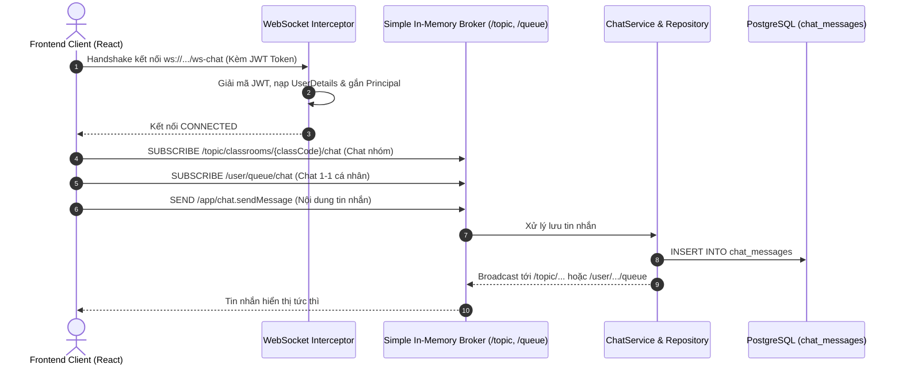

# Hướng Dẫn Kỹ Thuật: Hệ Thống Chat Thời Gian Thực (Realtime Chat Guide)

Tài liệu này mô tả chi tiết kiến trúc, mô hình dữ liệu, cơ chế phân quyền bảo mật và giao thức giao tiếp thời gian thực cho module Chat trong hệ thống **MathClass Backend**.

---

## 1. Tổng Quan Kiến Trúc

Hệ thống Chat trong MathClass phục vụ 2 mục đích chính:
1. **Chat Nhóm Lớp Học (`CLASSROOM`):** Toàn bộ học sinh và giáo viên trong một lớp có thể trao đổi kiến thức, thảo luận bài tập chung.
2. **Chat Trực Tiếp 1-1 (`DIRECT`):**
   - Học sinh trao đổi riêng với Giáo viên phụ trách lớp.
   - Học sinh trao đổi riêng với Bạn học cùng lớp (`CLASSMATE`).

Hệ thống kết hợp mô hình **Hybrid (REST API + WebSocket STOMP)**:
- **REST API:** Truy xuất lịch sử tin nhắn cũ (phân trang Cursor/Pageable), kiểm tra trạng thái online, đếm tin nhắn chưa đọc và đánh dấu đã đọc (`markAsRead`).
- **WebSocket STOMP:** Đẩy tin nhắn theo thời gian thực (Push notification, tin nhắn mới, sự kiện Online/Offline).



---

## 2. Mô Hình Dữ Liệu (`chat_messages`)

Bảng `chat_messages` được quản lý bởi Flyway Migration `V3__add_chat_type_and_recipient_to_chat_messages.sql`:

```sql
CREATE TABLE IF NOT EXISTS chat_messages (
    id BIGSERIAL PRIMARY KEY,
    classroom_id BIGINT NOT NULL REFERENCES classrooms(id) ON DELETE CASCADE,
    sender_id BIGINT NOT NULL REFERENCES users(id) ON DELETE CASCADE,
    recipient_id BIGINT REFERENCES users(id) ON DELETE CASCADE, -- NULL nếu là chat nhóm lớp
    chat_type VARCHAR(20) NOT NULL DEFAULT 'CLASSROOM',       -- 'CLASSROOM' hoặc 'DIRECT'
    content TEXT NOT NULL,
    is_read BOOLEAN NOT NULL DEFAULT FALSE,
    created_at TIMESTAMP WITH TIME ZONE DEFAULT CURRENT_TIMESTAMP,
    updated_at TIMESTAMP WITH TIME ZONE DEFAULT CURRENT_TIMESTAMP
);

CREATE INDEX idx_chat_messages_classroom_created ON chat_messages(classroom_id, created_at DESC);
CREATE INDEX idx_chat_messages_direct ON chat_messages(classroom_id, sender_id, recipient_id);
```

---

## 3. Cơ Chế Phân Quyền & Bảo Mật Chat

1. **Xác thực Handshake WebSocket:**
   - Client truyền JWT qua Query param `?token=...` hoặc Cookie `mathclass_jwt` khi handshake HTTP Upgrade.
   - `WebSocketSecurityInterceptor` xác minh tính hợp lệ của Token trước khi cho phép thiết lập phiên.

2. **Kiểm tra Tư cách Thành viên Lớp học:**
   - Người dùng **chỉ được phép** gửi hoặc đọc tin nhắn trong lớp học nếu họ là Giáo viên sở hữu lớp (`teacher_id`) hoặc Học sinh đã được duyệt (`ClassroomMember` trạng thái `ACTIVE`).
   - Ngăn chặn hoàn toàn học sinh ngoài lớp nghe lén tin nhắn hoặc phát tán tin rác (BOLA/IDOR prevention).

3. **Quy định Chat 1-1 (`DIRECT`):**
   - Học sinh chỉ được chat 1-1 với:
     - Giáo viên của lớp.
     - Các bạn học sinh khác có cùng lớp học chung (`isClassmate`).

---

## 4. Danh Sách REST Endpoints Bổ Trợ

Toàn bộ APIs nằm dưới tiền tố `/api/v1/classrooms/{classCode}/chat`:

| Method | Endpoint | Quyền hạn | Mô tả |
| :--- | :--- | :--- | :--- |
| `GET` | `/messages` | Thành viên lớp | Lấy lịch sử chat chung/riêng (Hỗ trợ query `studentId`, phân trang `page`, `size`). |
| `PUT` | `/messages/read` | Thành viên lớp | Đánh dấu đã đọc toàn bộ tin nhắn nhận được. |
| `GET` | `/online-users` | Thành viên lớp | Danh sách ID người dùng đang online trong phòng chat. |
| `GET` | `/unread-students`| `TEACHER` | Danh sách học sinh có tin nhắn gửi tới giáo viên mà chưa được đọc. |
| `GET` | `/unread-summary` | Thành viên lớp | Đếm số lượng tin nhắn chưa đọc tổng thể. |
| `GET` | `/group/messages` | Thành viên lớp | Lịch sử chat nhóm lớp học. |
| `PUT` | `/group/read` | Thành viên lớp | Đánh dấu đã đọc chat nhóm. |
| `GET` | `/direct/{otherUserId}/messages` | Thành viên lớp | Lịch sử chat 1-1 với một tài khoản cụ thể. |
| `PUT` | `/direct/{otherUserId}/read` | Thành viên lớp | Đánh dấu đã đọc chat 1-1 với người đó. |
