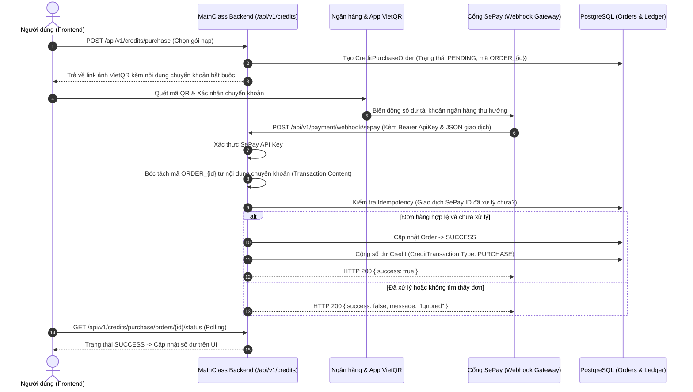

# Hướng Dẫn Vận Hành & Tích Hợp Cổng Thanh Toán SePay VietQR (Payment Gateway Guide)

Tài liệu này mô tả chi tiết quy trình xử lý thanh toán tự động qua **VietQR** kết hợp cổng **SePay Webhook** để nạp AI Credit trong hệ thống **MathClass Backend**.

---

## 1. Tổng Quan Quy Trình Nạp Credit Tự Động

Cơ chế nạp tiền sử dụng phương thức chuyển khoản ngân hàng qua mã VietQR động. Khi người dùng chuyển khoản thành công, ngân hàng sẽ gửi thông báo đến SePay, sau đó SePay tự động bắn Webhook về backend MathClass để tự động cộng Credit cho người dùng trong vòng 1-3 giây.



---

## 2. Mô Hình Dữ Liệu Thanh Toán

Hệ thống quản lý thanh toán thông qua 2 bảng chính được khởi tạo bởi Flyway Migration `V13__payment_gateway_integration.sql`:

1. **`credit_purchase_orders`:**
   - `id`: Mã định danh đơn hàng (dùng để sinh chuỗi chuyển khoản `ORDER_{id}`).
   - `user_id`: ID người dùng thực hiện nạp tiền.
   - `package_id`: Gói credit được chọn mua.
   - `amount`: Số tiền cần chuyển (VND).
   - `credits`: Số credit sẽ được cộng vào tài khoản khi thành công.
   - `status`: Trạng thái đơn (`PENDING`, `SUCCESS`, `FAILED`, `CANCELLED`).
   - `transaction_code`: Mã giao dịch nhận từ ngân hàng/SePay.

2. **`payment_configs`:**
   - Lưu trữ cấu hình ngân hàng thụ hưởng (Ngân hàng, Số tài khoản, Tên chủ thẻ).
   - `sepay_api_key`: Khóa bí mật dùng để xác thực các request Webhook gửi từ SePay.
   - `is_active`: Cờ bật/tắt cổng thanh toán tự động.

---

## 3. Cơ Chế Bảo Mật & Phòng Chống Gian Lận (Security & Anti-Fraud)

1. **Xác thực Webhook Signature/API Key:**
   - Mọi request gửi tới endpoint `POST /api/v1/payment/webhook/sepay` bắt buộc phải có Header:
     ```http
     Authorization: Bearer <SEPAY_API_KEY>
     ```
   - Nếu không khớp với cấu hình trong `payment_configs`, hệ thống lập tức từ chối với mã HTTP `401 Unauthorized`.

2. **Cơ Chế Idempotency (Chống Double Credit):**
   - Mỗi giao dịch chuyển khoản từ SePay có một `id` định danh duy nhất.
   - Hệ thống kiểm tra xem mã giao dịch SePay này đã từng được ghi nhận trong `credit_transactions` chưa. Nếu đã có, hệ thống lập tức bỏ qua và trả HTTP 200 nhằm tránh việc cộng Credit 2 lần do mạng chập chờn gửi lại webhook.

3. **Kiểm tra Số Tiền Khớp Chính Xác:**
   - Hệ thống so sánh số tiền chuyển thực tế (`transferAmount`) với số tiền của đơn hàng (`order.getAmount()`).
   - Nếu số tiền chuyển ít hơn giá trị gói, trạng thái đơn sẽ được chuyển sang diện nghi vấn hoặc thông báo lỗi, không tự động cộng Credit.

---

## 4. Hướng Dẫn Cấu Hình Môi Trường

Khai báo các biến môi trường cần thiết trong tệp `.env`:

```env
# Cấu hình thanh toán SePay
SEPAY_API_KEY=your_sepay_webhook_api_key_secret
SEPAY_ACCOUNT_NUMBER=0123456789
SEPAY_BANK_NAME=MBBank
SEPAY_ACCOUNT_NAME=NGUYEN VAN A
```

---

## 5. Danh Sách API Thanh Toán Chính

| Method | Endpoint | Quyền hạn | Mô tả |
| :--- | :--- | :--- | :--- |
| `POST` | `/api/v1/credits/purchase` | Authenticated | Khởi tạo đơn nạp Credit, trả về URL VietQR. |
| `GET` | `/api/v1/credits/purchase/orders/{orderId}/status` | Authenticated | Kiểm tra trạng thái đơn nạp tiền (Polling). |
| `POST` | `/api/v1/payment/webhook/sepay` | SePay Secret Header | Endpoint nhận Webhook tự động từ SePay. |
| `GET` | `/api/v1/admin/payment/config` | `ADMIN` | Quản trị viên xem cấu hình ngân hàng & API Key. |
| `PUT` | `/api/v1/admin/payment/config` | `ADMIN` | Cập nhật thông tin ngân hàng & API Key. |
