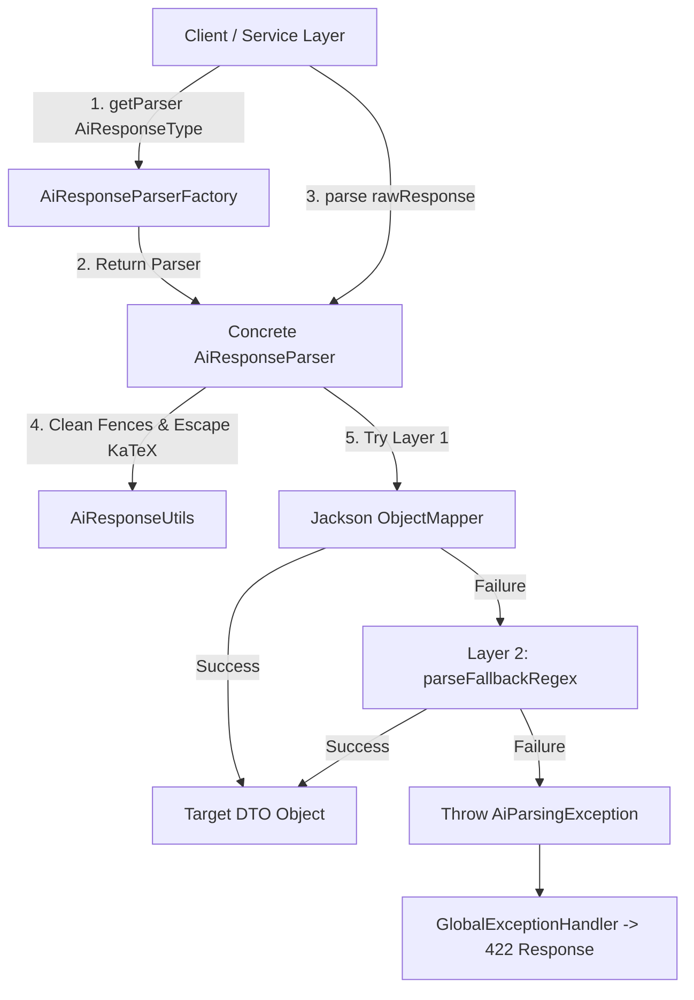
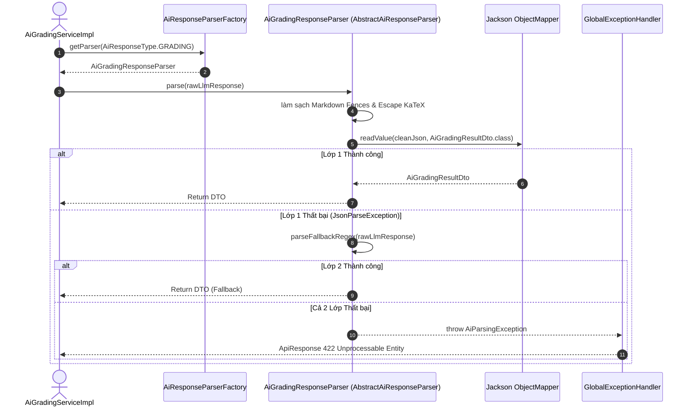

# Specification: Strategy Pattern Phase 4 — AI Response Parsing Strategy (`MathClass-service`)

---

## 1. Feature Overview
- **Feature Name:** Strategy Pattern Phase 4 — AI Response Parsing Strategy (Chiến lược Bóc tách Dữ liệu Phản hồi AI)
- **Jira Ticket:** [MAT-343](https://phanvanluan611996.atlassian.net/browse/MAT-343)
- **Target Subsystems:** `MathClass-service` (Backend Microservice — Java 21 / Spring Boot 4.x+)
- **Target Users:** Internal AI Services, Teachers, Students

---

## 2. Business Goal & Core Objectives

Hệ thống MathClass tích hợp các mô hình ngôn ngữ lớn (LLM như Gemini, OpenAI, Claude) cho nhiều tính năng cốt lõi: Chấm bài tự luận, Gợi ý giải toán từng bước, Nhận diện bài làm viết tay/Canvas, Sinh tự động đề thi/câu hỏi, và Tạo nhận xét học sinh.

Trước đây, việc làm sạch chuỗi, bóc tách JSON và giải mã dữ liệu phản hồi từ AI được xử lý thủ công, phân tán trực tiếp trong từng `ServiceImpl`. Điều này dẫn đến:
- **Trùng lặp mã nguồn (Code Duplication):** Đoạn mã gọi Jackson `ObjectMapper` và Regex làm sạch lặp đi lặp lại ở nhiều nơi.
- **Rủi ro rò rỉ ngoại lệ (Uncaught Exception):** Khi AI trả về văn bản kèm giải thích hoặc JSON bị đứt đoạn do chạm giới hạn token, các Service dễ gặp lỗi `JsonParseException` không được bọc xử lý thống nhất.
- **Vi phạm SRP & OCP:** Service nghiệp vụ vừa làm nhiệm vụ gọi AI vừa chịu trách nhiệm bóc tách cú pháp dữ liệu thô.

Mục tiêu Phase 4 là triển khai **Strategy Pattern & Template Method Engine** chuẩn hóa toàn bộ luồng bóc tách phản hồi AI:

1. **Chuẩn hóa Hợp đồng Bóc tách (`AiResponseParser<T>`):** Định nghĩa interface nhất quán chuyển đổi chuỗi phản hồi thô của LLM thành DTO nghiệp vụ tương ứng.
2. **Cơ chế Xử lý Lỗi 2 Lớp (Smart 2-Layer Parsing Engine):**
   - **Lớp 1 (JSON Standard):** Tự động làm sạch Markdown Code Fences, bảo toàn ký tự KaTeX và giải mã bằng Jackson `ObjectMapper`.
   - **Lớp 2 (Regex Fallback):** Nếu Lớp 1 thất bại hoặc AI trả về văn bản giải thích bao quanh, tự động kích hoạt bộ trích xuất Regex dự phòng.
3. **Quản lý Linh hoạt (`AiResponseParserFactory`):** Tự động inject và cung cấp Parser phù hợp thông qua Spring Container dựa trên `AiResponseType`.
4. **Tuyệt Đối Giữ Nguyên API Contract:** Giữ nguyên 100% các REST API & DTO phản hồi phía Frontend.
5. **Xử lý Ngoại lệ Tập trung (`GlobalExceptionHandler`):** Bọc `AiParsingException` ném ra phản hồi API chuẩn `422 Unprocessable Entity` kèm thông điệp rõ ràng cho client.

---

## 3. Potential Logic Loopholes & Mitigations (6 Key Edge Cases)

### 3.1. Case 1: Ký tự Backslash (`\`) trong công thức toán KaTeX làm hỏng Jackson JSON Parser
- **Vấn đề:** AI trả về công thức KaTeX như `\frac{1}{2}` hoặc `\sum`. Jackson `ObjectMapper` nhầm lẫn `\f` là Formfeed escape sequence trong JSON làm ném `JsonParseException`.
- **Khắc phục:** `AbstractAiResponseParser` tự động gọi `AiResponseUtils.escapeLatexBackslashesInJson()` để nhân đôi backslash thành `\\frac{1}{2}` trước khi parse JSON.

### 3.2. Case 2: Phản hồi AI bị đứt đoạn (Truncated JSON) do chạm giới hạn token
- **Vấn đề:** Chuỗi JSON trả về bị cắt ngang giữa chừng (thiếu dấu `}` hoặc `]`) làm Jackson không đọc được.
- **Khắc phục:** Lớp 1 tự động chạy `AiResponseUtils.repairTruncatedJson()` để tự động bổ sung các dấu ngoặc mở/đóng còn thiếu. Nếu vẫn thất bại, Lớp 2 Regex sẽ trích xuất các trường dữ liệu hoàn chỉnh đã sinh ra trước đó.

### 3.3. Case 3: AI trả về kèm văn bản giải thích bao ngoài Markdown Code Block
- **Vấn đề:** Phản hồi chứa các câu dẫn như "Dưới đây là kết quả:" ở đầu hoặc ghi chú ở cuối.
- **Khắc phục:** `AiResponseUtils.extractCleanJson()` trích xuất chính xác đoạn văn bản nằm giữa cặp ngoặc bao ngoài cùng `{...}` hoặc `[...]`.

### 3.4. Case 4: Cả Lớp 1 (JSON) và Lớp 2 (Regex) đều thất bại do dữ liệu rác từ LLM
- **Vấn đề:** AI trả về chuỗi văn bản không tuân theo bất kỳ cấu trúc nào, làm crash ngầm ứng dụng.
- **Khắc phục:** Ném `AiParsingException` bọc rõ thông tin Parser và chuỗi thô. `GlobalExceptionHandler` bắt ngoại lệ và trả về HTTP status 422 kèm message thông báo lỗi thân thiện.

### 3.5. Case 5: Double HTML / KaTeX Escaping khi parse nhiều lần
- **Vấn đề:** Các chuỗi escape bị thay thế chồng chéo dẫn đến hiển thị `\\frac` thành `\\\\frac` trên Frontend.
- **Khắc phục:** Chuẩn hóa quy trình: Làm sạch Markdown Fences ➔ Sanitizer KaTeX 1 lần duy nhất tại `AbstractAiResponseParser`.

### 3.6. Case 6: Concurrent Modification / Thread-safety khi Inject Factory
- **Vấn đề:** Nhiều request đồng thời gọi `getParser()` gây ra xung đột bộ nhớ.
- **Khắc phục:** `AiResponseParserFactory` khởi tạo `ImmutableMap` trong Constructor, hoàn toàn thread-safe.

---

## 4. Functional Requirements

- **FR-1 (Enum & Type Registry):** Định nghĩa `AiResponseType` gồm: `GRADING`, `HINT`, `QUESTION`, `HANDWRITING`, `REMARK`.
- **FR-2 (Core Strategy Interface):** Định nghĩa `AiResponseParser<T>` với phương thức `T parse(String rawResponse)` và `boolean supports(AiResponseType type)`.
- **FR-3 (Template Method Abstract Base):** `AbstractAiResponseParser<T>` triển khai luồng bóc tách 2 lớp:
  - Lớp 1: Jackson `ObjectMapper` + `AiResponseUtils`.
  - Lớp 2: `parseFallbackRegex(String rawResponse)` phương thức abstract cho các subclass.
- **FR-4 (Concrete Parser Implementation):** Triển khai 5 class parser cụ thể:
  - `AiGradingResponseParser` ➔ `AiGradingResultDto`
  - `AiHintResponseParser` ➔ `AiHintResultDto`
  - `AiQuestionResponseParser` ➔ `AiBatchQuestionResponse`
  - `AiHandwritingResponseParser` ➔ `AiHandwritingResultDto`
  - `AiRemarkResponseParser` ➔ `AiRemarkJsonResponse`
- **FR-5 (Spring Factory Management):** `AiResponseParserFactory` tự động quét danh sách Bean `AiResponseParser<?>` và truy xuất qua `getParser(type)`.
- **FR-6 (Service Layer Refactoring):** Chuyển đổi 5 AI Services (`AiGradingServiceImpl`, `AiHintServiceImpl`, `AiSubmissionHandwritingServiceImpl`, `StudentRemarkAiServiceImpl`, `AiBatchQuestionGeneratorService`) sang sử dụng `AiResponseParserFactory`.
- **FR-7 (Global Exception Handling):** Đăng ký `@ExceptionHandler(AiParsingException.class)` trong `GlobalExceptionHandler` trả về HTTP 422.

---

## 5. Business Rules

- **BR-1 (100% Backward Compatibility):** Giữ nguyên toàn bộ cấu trúc DTO và API Contract hiện có phía Frontend.
- **BR-2 (2-Layer Priority Rule):** Ưu tiên bóc tách JSON chuẩn qua Jackson trước. Chỉ khi Lớp 1 ném ngoại lệ mới chuyển sang Lớp 2 Regex Fallback.
- **BR-3 (KaTeX Preservation Rule):** Mọi công thức toán KaTeX trong nhận xét, lời giải, câu hỏi phải được bảo toàn nguyên vẹn ký tự `\`.
- **BR-4 (Graceful Exception Containment):** Không để lọt bất kỳ `JsonParseException` hoặc `NullPointerException` chưa được kiểm soát ra phía client.

---

## 6. Package Layout Structure

```
com.codegym.mathclass/
└── ai/
    └── strategy/
        └── parser/
            ├── AiResponseType.java             # Enum định danh loại phản hồi AI
            ├── AiResponseParser.java           # Core Strategy Interface
            ├── AbstractAiResponseParser.java   # Abstract Class với thuật toán 2 lớp
            ├── AiResponseParserFactory.java    # Factory truy xuất Parser
            ├── exception/
            │   └── AiParsingException.java     # Custom Runtime Exception
            └── impl/
                ├── AiGradingResponseParser.java
                ├── AiHintResponseParser.java
                ├── AiQuestionResponseParser.java
                ├── AiHandwritingResponseParser.java
                └── AiRemarkResponseParser.java
```

---

## 7. Architecture Overview & Sequence Diagram

### 7.1. Bức Tranh Kiến Trúc (Architecture Overview)



---

### 7.2. Sequence Diagram — Luồng Bóc Tách Dữ Liệu Phản Hồi AI



---

## 8. Acceptance Criteria Checklist

- [ ] **AC-1 (Core Framework):** Khởi tạo thành công `AiResponseType`, `AiResponseParser<T>`, `AbstractAiResponseParser<T>`, và `AiResponseParserFactory`.
- [ ] **AC-2 (Cơ chế 2 Lớp):** Bóc tách JSON chuẩn ở Lớp 1; Tự động fallback sang Regex ở Lớp 2 khi JSON lỗi.
- [ ] **AC-3 (Bảo toàn KaTeX):** Các công thức toán LaTeX không bị lỗi escape backslash.
- [ ] **AC-4 (5 Parsers Cụ Thể):** Triển khai đầy đủ `AiGradingResponseParser`, `AiHintResponseParser`, `AiQuestionResponseParser`, `AiHandwritingResponseParser`, `AiRemarkResponseParser`.
- [ ] **AC-5 (Refactor 5 AI Services):** Chuyển đổi 5 AI Services hiện tại sang dùng `AiResponseParserFactory`.
- [ ] **AC-6 (Xử lý Ngoại lệ):** `GlobalExceptionHandler` bắt `AiParsingException` và trả về mã HTTP 422 chuẩn.
- [ ] **AC-7 (Backward Compatibility):** Giữ nguyên 100% DTO và API contract phía Frontend.

---

## 9. Unit & Integration Test Cases Checklist

### 9.1. Backend Unit Tests (`AiResponseParserFactoryTest`, `AbstractAiResponseParserTest`, Concrete Parser Tests)
- [ ] **UT-BE-01:** `getParser_ValidType_ShouldReturnCorrectParserInstance()`
- [ ] **UT-BE-02:** `parse_ValidJson_ShouldReturnDtoViaLayer1()`
- [ ] **UT-BE-03:** `parse_InvalidJsonWithMarkdownFences_ShouldCleanAndParseViaLayer1()`
- [ ] **UT-BE-04:** `parse_MalformedJson_ShouldFallbackToLayer2RegexAndSucceed()`
- [ ] **UT-BE-05:** `parse_UnrecoverableGarbage_ShouldThrowAiParsingException()`
- [ ] **UT-BE-06:** `parse_LatexFormula_ShouldPreserveBackslashes()`
- [ ] **UT-BE-07:** `aiGradingServiceImpl_ShouldDelegateToParserFactory()`

---

## 10. Implementation Checklist

- [ ] Tạo enum `AiResponseType` và interface `AiResponseParser<T>`.
- [ ] Tạo exception `AiParsingException`.
- [ ] Triển khai `AbstractAiResponseParser<T>` với thuật toán 2 lớp.
- [ ] Triển khai `AiResponseParserFactory` quản lý Spring Beans.
- [ ] Triển khai 5 Concrete Parsers (`AiGradingResponseParser`, `AiHintResponseParser`, `AiQuestionResponseParser`, `AiHandwritingResponseParser`, `AiRemarkResponseParser`).
- [ ] Cập nhật `GlobalExceptionHandler` hỗ trợ `AiParsingException`.
- [ ] Refactor 5 AI Services (`AiGradingServiceImpl`, `AiHintServiceImpl`, `AiSubmissionHandwritingServiceImpl`, `StudentRemarkAiServiceImpl`, `AiBatchQuestionGeneratorService`).
- [ ] Bổ sung bộ Unit Tests toàn bộ module AI Strategy Parser.
- [ ] Chạy `./gradlew compileJava` và `./gradlew test` xác nhận thành công 100%.
