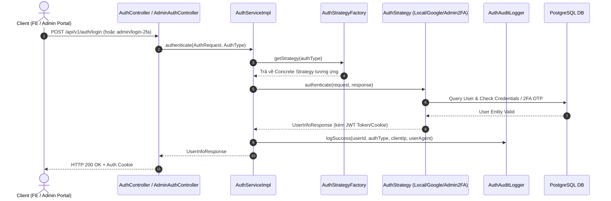

# Specification: Strategy Pattern Phase 3 — Multi-method Auth Strategy (`MathClass-service`)

---

## 1. Feature Overview
- **Feature Name:** Strategy Pattern Phase 3 — Multi-method Auth Strategy (Xác thực Danh tính đa phương thức)
- **Jira Ticket:** [MAT-344](https://phanvanluan611996.atlassian.net/browse/MAT-344)
- **Target Subsystems:** `MathClass-service` (Backend Microservice — Java 21 / Spring Boot 4.x+)
- **Target Users:** Teachers (Giáo viên), Students (Học sinh), System Administrators

---

## 2. Business Goal & Core Objectives

Hệ thống MathClass phục vụ các nhóm người dùng khác nhau với các phương thức xác thực đa dạng (Mật khẩu truyền thống, Google OAuth2 SSO, và Cổng Quản trị viên tích hợp xác thực 2 bước 2FA/TOTP).

Trước đây, `AuthServiceImpl` trực tiếp đảm nhận toàn bộ logic đăng nhập local, đăng nhập Google, tạo user mới, cấp token JWT và kiểm tra quyền admin. Điều này gây ra hiện tượng God Class, vi phạm Nguyên tắc Đơn trách nhiệm (SRP) và Mở/Đóng (OCP), khiến việc mở rộng thêm các nhà cung cấp SSO mới (như Facebook, Apple, Zalo) dễ gây nguy cơ đứt gãy hệ thống.

Tái cấu trúc module Auth theo **kiến trúc Strategy Pattern & Facade Registry**:

1. **Tái cấu trúc theo Strategy Pattern:** Phân tách hoàn toàn trách nhiệm xác thực giữa từng hình thức đăng nhập (`AuthStrategy`, `LocalPasswordAuthStrategy`, `GoogleOAuth2AuthStrategy`, `AdminPortalAuthStrategy`).
2. **Quản lý Strategy linh hoạt qua Registry (`AuthStrategyFactory`):** Tận dụng Spring Autowiring để tự động tiêm các Strategy Bean, sẵn sàng mở rộng nhà cung cấp SSO mới mà không cần sửa code cũ (0-code modification ở Factory).
3. **Tuyệt Đối Giữ Nguyên API Contract:** Giữ nguyên 100% các REST API cũ (`/api/v1/auth/login`, `/api/v1/auth/google`, `/api/v1/auth/signup`...) cho Frontend (`MathClass-fe`).
4. **Tăng Cường Bảo Mật Cổng Admin:** Tách biệt luồng đăng nhập Admin với bảo vệ 2FA/TOTP OTP bắt buộc qua endpoint `/api/v1/auth/admin/login-2fa`.
5. **Ghi Nhật Ký Đăng Nhập (Audit Logging):** Tự động lưu vết thông tin người dùng (`AuthType`, Client IP, User-Agent, Trạng thái) phục vụ công tác truy vết an ninh.

Bảng ánh xạ phương thức xác thực (Auth Strategy Routing Table):

| AuthType | Đối tượng áp dụng | Cơ chế xác thực | Quyền hạn mặc định |
| :--- | :--- | :--- | :--- |
| `LOCAL` | Student, Teacher | Email + Mật khẩu mã hóa BCrypt | Role của User trong DB |
| `GOOGLE` | Student, Teacher | Google IdToken SSO | `ROLE_STUDENT` (auto-register nếu chưa có) |
| `ADMIN_2FA` | System Administrator | Email + Password + Mã OTP 2FA 6 chữ số | Bắt buộc `ROLE_ADMIN` |

---

## 3. Potential Logic Loopholes & Mitigations (6 Key Edge Cases)

### 3.1. Case 1: Tấn công Brute-force mật khẩu & mã OTP 2FA Admin
- **Vấn đề:** Kẻ xấu thử nhiều lần mật khẩu hoặc mã 6 chữ số OTP của Admin gây mất an toàn hệ thống.
- **Khắc phục:** Tích hợp kiểm tra đếm số lần thất bại, tạm khóa xác thực 15 phút khi nhập sai OTP quá 5 lần liên tiếp.

### 3.2. Case 2: Tự động đăng ký User mới qua Google OAuth2 bị gán nhầm quyền Admin
- **Vấn đề:** User sử dụng Google SSO lần đầu tiên có thể bị cấp nhầm đặc quyền cao.
- **Khắc phục:** Giới hạn cứng vai trò mặc định cho tài khoản tự động tạo mới qua Google SSO là `ROLE_STUDENT`. Ném `AccessDeniedException` nếu muốn gán quyền Admin qua SSO.

### 3.3. Case 3: Trạng thái tài khoản đã bị khóa nhưng vẫn xác thực Google SSO thành công
- **Vấn đề:** Admin đã khóa tài khoản user (`isLocked() = true`), nhưng user dùng Google SSO vẫn vượt qua lớp check của Google.
- **Khắc phục:** `GoogleOAuth2AuthStrategy` bắt buộc phải nạp User từ DB và kiểm tra `user.isLocked()` trước khi phát hành JWT token. Ném `AccountLockedException` nếu tài khoản đã bị khóa.

### 3.4. Case 4: Lỗi giả mạo Client IP khi đứng sau Proxy / Load Balancer
- **Vấn đề:** Đọc `request.getRemoteAddr()` thu được IP nội bộ của Nginx / Load Balancer thay vì IP thực của người dùng.
- **Khắc phục:** Trích xuất IP thực qua HTTP Header `X-Forwarded-For` hoặc `X-Real-IP` trong helper audit log.

### 3.5. Case 5: Không tìm thấy Strategy phù hợp cho `AuthType` yêu cầu
- **Vấn đề:** Truyền một `AuthType` không được hỗ trợ hoặc chưa đăng ký Bean Strategy.
- **Khắc phục:** `AuthStrategyFactory` ném `ResourceNotFoundException` với thông điệp rõ ràng, được xử lý bởi `GlobalExceptionHandler` trả về HTTP `400 Bad Request`.

### 3.6. Case 6: Concurrent Login từ nhiều thiết bị làm hỏng Refresh Token Cookie
- **Vấn đề:** Đăng nhập trên tab mới làm ghi đè hỏng Cookie Refresh Token của tab cũ.
- **Khắc phục:** Giữ nguyên cơ chế tạo Refresh Token riêng biệt kèm cookie path chỉ định `/api/v1/auth/refresh`.

---

## 4. Functional Requirements

- **FR-1 (Core Strategy Architecture):** Định nghĩa interface `AuthStrategy<T>` với các phương thức `authenticate(request, response)` và `supports(authType)`.
- **FR-2 (Local Password Strategy):** Triển khai `LocalPasswordAuthStrategy` kiểm tra email, BCrypt password, trạng thái khóa và cấp JWT Access Token + Cookie.
- **FR-3 (Google OAuth2 Strategy):** Triển khai `GoogleOAuth2AuthStrategy` xác thực IdToken, tự động tạo tài khoản Học sinh mới nếu chưa tồn tại.
- **FR-4 (Admin Portal 2FA Strategy):** Triển khai `AdminPortalAuthStrategy` kiểm tra `ROLE_ADMIN` và xác thực mã TOTP 2FA qua `TwoFactorAuthService`.
- **FR-5 (Strategy Factory Registry):** Triển khai `AuthStrategyFactory` tự động chọn Strategy dựa trên `supports(AuthType)`.
- **FR-6 (Audit Logging Component):** Triển khai `AuthAuditLogger` ghi vết lịch sử đăng nhập (`client_ip`, `user_agent`, `auth_type`, `status`) vào hệ thống.
- **FR-7 (Backward Compatibility):** Giữ nguyên 100% signature và response DTO cho các endpoint `/api/v1/auth/*` hiện tại.

---

## 5. Business Rules

- **BR-1 (100% Backward Compatibility):** Không làm đứt gãy REST APIs hiện có phía Frontend (`MathClass-fe`).
- **BR-2 (Admin 2FA Mandatory Rule):** Tài khoản đăng nhập qua `AdminPortalAuthStrategy` bắt buộc phải có vai trò `ROLE_ADMIN` và mã 2FA OTP 6 chữ số chính xác.
- **BR-3 (Non-Lockout Verification):** Tài khoản bị khóa (`isLocked() = true`) không được phép đăng nhập dưới bất kỳ hình thức nào.
- **BR-4 (Default Google Role):** User mới tạo tự động từ Google SSO luôn có vai trò mặc định là `ROLE_STUDENT`.
- **BR-5 (Audit Trail Completeness):** Mọi giao dịch xác thực (thành công hoặc thất bại) đều phải được ghi vết nhật ký audit.
- **BR-6 (Open/Closed Principle Compliance):** Thêm phương thức Auth mới chỉ cần thêm mới 1 Class triển khai `AuthStrategy` mà không sửa code của `AuthServiceImpl` hoặc `AuthStrategyFactory`.

---

## 6. Data Model & Package Structure

### 6.1. Audit Log Schema — Bảng `auth_audit_logs`

```sql
CREATE TABLE auth_audit_logs (
    id BIGSERIAL PRIMARY KEY,
    user_id BIGINT REFERENCES users(id),
    email VARCHAR(255) NOT NULL,
    auth_type VARCHAR(20) NOT NULL,          -- LOCAL | GOOGLE | ADMIN_2FA
    status VARCHAR(20) NOT NULL,             -- SUCCESS | FAILED | LOCKED
    client_ip VARCHAR(50),
    user_agent VARCHAR(500),
    failure_reason VARCHAR(255),
    created_at TIMESTAMP,
    updated_at TIMESTAMP
);

CREATE INDEX idx_auth_audit_email ON auth_audit_logs(email, created_at DESC);
```

### 6.2. Package Layout Structure

```
com.codegym.mathclass.auth/
├── controller/
│   ├── AuthController.java                  # REST endpoints: login, google-login, logout, refresh...
│   └── AdminAuthController.java             # Endpoint mới: POST /api/v1/auth/admin/login-2fa
├── dto/
│   ├── request/
│   │   ├── AuthType.java                    # Enum: LOCAL, GOOGLE, ADMIN_2FA
│   │   ├── LoginRequest.java                # DTO đăng nhập local (email, password)
│   │   ├── GoogleAuthRequest.java           # DTO đăng nhập Google (idToken)
│   │   └── Admin2FaLoginRequest.java        # DTO đăng nhập Admin 2FA (email, password, otpCode)
│   └── response/
│       └── UserInfoResponse.java            # DTO trả về thông tin User + JWT Token
├── service/
│   ├── AuthService.java                     # Main Business Interface
│   └── impl/
│       └── AuthServiceImpl.java             # Facade Service & Audit Dispatcher
├── strategy/
│   ├── AuthStrategy.java                    # Generic Strategy Core Interface
│   ├── AuthStrategyFactory.java             # Strategy Registry & Dispatcher
│   ├── impl/
│   │   ├── LocalPasswordAuthStrategy.java   # Local Auth Strategy
│   │   ├── GoogleOAuth2AuthStrategy.java    # Google SSO Strategy
│   │   └── AdminPortalAuthStrategy.java     # Admin 2FA Strategy
│   └── audit/
│       └── AuthAuditLogger.java             # Audit Logger Component
```

---

## 7. API Contract & DTO Schemas

> Prefix: `/api/v1`. Chuẩn phản hồi: `ApiResponse<T>`.

### 7.1. Enum `AuthType`
```java
package com.codegym.mathclass.auth.dto.request;

public enum AuthType {
    LOCAL,
    GOOGLE,
    ADMIN_2FA
}
```

### 7.2. Admin 2FA Request DTO (`Admin2FaLoginRequest`)
```java
package com.codegym.mathclass.auth.dto.request;

import jakarta.validation.constraints.Email;
import jakarta.validation.constraints.NotBlank;
import jakarta.validation.constraints.Size;

public record Admin2FaLoginRequest(
        @NotBlank @Email String email,
        @NotBlank String password,
        @NotBlank @Size(min = 6, max = 6) String otpCode
) {}
```

### 7.3. Endpoint Đăng nhập Admin 2FA
- **Endpoint:** `POST /api/v1/auth/admin/login-2fa`
- **Request Body:**
```json
{
  "email": "admin@mathclass.edu.vn",
  "password": "AdminPassword123!",
  "otpCode": "849201"
}
```
- **Response `200 OK`:**
```json
{
  "code": 200,
  "message": "Đăng nhập Quản trị viên thành công",
  "data": {
    "id": 1,
    "username": "admin",
    "email": "admin@mathclass.edu.vn",
    "roles": ["ROLE_ADMIN"],
    "accessToken": "eyJhbGciOiJIUzI1NiJ9..."
  }
}
```

---

## 8. Architecture Overview & Sequence Diagrams

### 8.1. Sequence Diagram — Luồng Đăng nhập Tổng thể qua Strategy



---

## 9. Core Interfaces & Strategy Pattern Specification

### 9.1. Core Interface (`AuthStrategy`)

```java
package com.codegym.mathclass.auth.strategy;

import com.codegym.mathclass.auth.entity.AuthType;
import com.codegym.mathclass.auth.dto.response.UserInfoResponse;
import jakarta.servlet.http.HttpServletResponse;

public interface AuthStrategy<T> {
    UserInfoResponse authenticate(T request, HttpServletResponse response);
    boolean supports(AuthType authType);
}
```

### 9.2. Strategy Factory (`AuthStrategyFactory`)

```java
package com.codegym.mathclass.auth.strategy;

import com.codegym.mathclass.auth.entity.AuthType;
import com.codegym.mathclass.common.exception.ResourceNotFoundException;
import org.springframework.stereotype.Component;
import java.util.List;

@Component
public class AuthStrategyFactory {

    private final List<AuthStrategy<?>> strategies;

    public AuthStrategyFactory(List<AuthStrategy<?>> strategies) {
        this.strategies = strategies;
    }

    @SuppressWarnings("unchecked")
    public <T> AuthStrategy<T> getStrategy(AuthType authType) {
        return (AuthStrategy<T>) strategies.stream()
                .filter(s -> s.supports(authType))
                .findFirst()
                .orElseThrow(() -> new ResourceNotFoundException(
                        "Không tìm thấy AuthStrategy hỗ trợ: " + authType));
    }
}
```

---

## 10. Non-Functional Requirements & Implementation Constraints

- **Framework:** Java 21 LTS, Spring Boot 4.x, Spring Security.
- **Security & Privacy:** Mã hóa mật khẩu bằng BCrypt; JWT Cookie bảo vệ HTTP-Only & SameSite; log audit không chứa mật khẩu thô hay token.
- **Performance:** Thời gian phản hồi API xác thực < 200ms.
- **Maintainability:** Cô lập hoàn toàn từng luồng auth trong file riêng; tuân thủ triệt để OCP và YAGNI.

---

## 11. Acceptance Criteria Checklist

- [ ] **AC-1 (Refactoring Structural Integrity):** Tách `AuthServiceImpl` thành công, ủy quyền cho `AuthStrategyFactory` chọn 3 strategy.
- [ ] **AC-2 (Local Auth Strategy):** Đăng nhập Email/Mật khẩu hoạt động đúng như cũ, cấp đủ JWT token + Cookie.
- [ ] **AC-3 (Google OAuth2 Strategy):** Đăng nhập Google với `idToken` tạo/tìm đúng user và trả về JWT token.
- [ ] **AC-4 (Admin 2FA Strategy):** Đăng nhập Admin yêu cầu đúng Email + Password + Mã OTP 6 chữ số hợp lệ. Từ chối tài khoản không có `ROLE_ADMIN`.
- [ ] **AC-5 (Zero Breaking Change):** Các API cũ phía FE (`/api/v1/auth/login`, `/api/v1/auth/google`, `/api/v1/auth/signup`) hoạt động bình thường 100%.
- [ ] **AC-6 (Audit Logging):** Mọi lượt đăng nhập đều được lưu vết `client_ip`, `user_agent`, `auth_type`, `status` vào bảng `auth_audit_logs`.

---

## 12. Unit & Integration Test Cases Checklist

### 12.1. Backend Unit Tests (`LocalPasswordAuthStrategyTest`, `GoogleOAuth2AuthStrategyTest`, `AdminPortalAuthStrategyTest`, `AuthStrategyFactoryTest`)
- [ ] **UT-BE-01:** `localAuth_validCredentials_shouldReturnUserInfoResponse()`
- [ ] **UT-BE-02:** `localAuth_wrongPassword_shouldThrowBadCredentialsException()`
- [ ] **UT-BE-03:** `localAuth_lockedAccount_shouldThrowAccountLockedException()`
- [ ] **UT-BE-04:** `googleAuth_validToken_existingUser_shouldAuthenticate()`
- [ ] **UT-BE-05:** `googleAuth_validToken_newUser_shouldAutoRegisterStudentRole()`
- [ ] **UT-BE-06:** `admin2FaAuth_validCredentialsAndOtp_shouldReturnAdminUserInfo()`
- [ ] **UT-BE-07:** `admin2FaAuth_invalidOtp_shouldThrowInvalidOtpException()`
- [ ] **UT-BE-08:** `admin2FaAuth_nonAdminRole_shouldThrowAccessDeniedException()`
- [ ] **UT-BE-09:** `strategyFactory_supportedAuthType_shouldReturnCorrectStrategy()`
- [ ] **UT-BE-10:** `strategyFactory_unsupportedAuthType_shouldThrowResourceNotFoundException()`

### 12.2. Backend Integration Tests (`AuthControllerIntegrationTest`)
- [ ] **IT-BE-01:** `POST /api/v1/auth/login` đăng nhập thường trả về 200 OK + JWT Cookie.
- [ ] **IT-BE-02:** `POST /api/v1/auth/google` đăng nhập Google trả về 200 OK.
- [ ] **IT-BE-03:** `POST /api/v1/auth/admin/login-2fa` với Admin + OTP 2FA trả về 200 OK.

---

## 13. Implementation Checklist

- [ ] Tạo enum `AuthType` (`LOCAL`, `GOOGLE`, `ADMIN_2FA`) và DTO `Admin2FaLoginRequest`.
- [ ] Tạo JPA Entity `AuthAuditLog` và Repository `AuthAuditLogRepository`.
- [ ] Định nghĩa interface `AuthStrategy<T>` và class `AuthStrategyFactory`.
- [ ] Triển khai `LocalPasswordAuthStrategy`.
- [ ] Triển khai `GoogleOAuth2AuthStrategy`.
- [ ] Triển khai `AdminPortalAuthStrategy` tích hợp `TwoFactorAuthService`.
- [ ] Triển khai `AuthAuditLogger` trích xuất Client IP & User-Agent.
- [ ] Cập nhật `AuthServiceImpl` thành Facade Service và tạo `AdminAuthController`.
- [ ] Bổ sung Unit Tests & Integration Tests cho module Auth.
- [ ] Chạy `./gradlew compileJava` và `./gradlew test` kiểm tra biên dịch hệ thống.
