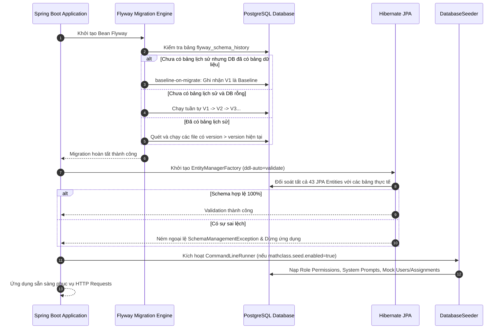

# Specification: Database Migration — Flyway Integration (`MathClass-service`)

---

## 1. Feature Overview

- **Feature Name:** Database Migration — Chuẩn hóa Quản trị Schema & Versioning Cơ sở dữ liệu bằng Flyway
- **Target Subsystems:** `MathClass-service` (Backend Spring Boot, PostgreSQL 16, Docker)
- **Target Users:** Backend Developers, DevOps/System Administrators

---

## 2. Business Goal & Core Objectives

Thay thế hoàn toàn cơ chế tự động sinh bảng tiềm ẩn rủi ro của Hibernate (`spring.jpa.hibernate.ddl-auto=update`) bằng **hệ thống Database Migration có quản lý phiên bản nghiêm ngặt (Flyway)**:

1. **Kiểm soát phiên bản mã nguồn Database (Database as Code):** Mọi thay đổi về cấu trúc bảng, khóa chính, khóa ngoại, cột, chỉ mục (Index) và ràng buộc (Constraint) đều được quản lý dưới dạng các tập tin SQL có số thứ tự (`V1`, `V2`, `V3`,...).
2. **Kích hoạt và khắc phục trạng thái Silent Failure hiện tại:** Dự án đã có sẵn các tập tin `V2__create_user_lock_histories_table.sql` và `V3__add_chat_type_and_recipient_to_chat_messages.sql` nhưng chưa có thư viện Flyway trong `build.gradle` và chưa có `V1__init_schema.sql`, dẫn đến các câu lệnh DDL tối ưu hóa và gỡ ràng buộc `NOT NULL` chưa từng được thực thi.
3. **Đồng nhất 100% môi trường:** Đảm bảo tất cả môi trường (Local Docker của từng developer, CI/CD runner, Staging server, Production) đều đạt cùng một trạng thái schema xác định.
4. **Bảo vệ toàn vẹn dữ liệu Production:** Chuyển đổi Hibernate sang chế độ kiểm tra tĩnh `ddl-auto=validate`, ngăn chặn triệt để nguy cơ vô tình làm rớt bảng, khóa bảng ngoài ý muốn hoặc để sót các cột "rác" khi xóa/đổi tên thuộc tính trong Java Entity.
5. **Tách bạch rõ ràng giữa Schema DDL và Data Seeding:**
   - **Flyway:** Chịu trách nhiệm toàn quyền đối với DDL (Cấu trúc bảng, Index, Khóa ngoại, Ràng buộc).
   - **`DatabaseSeeder.java`:** Tiếp tục đảm nhiệm việc nạp dữ liệu mẫu nghiệp vụ (Mock/Sample Data) phục vụ phát triển khi cờ `mathclass.seed.enabled=true`.

---

## 3. Potential Logic Loopholes & Mitigations (6 Key Edge Cases)

### 3.1. Case 1: Khởi động trên Database đã có dữ liệu từ trước (Existing Non-Empty Database)

- **Vấn đề:** Khi bật Flyway trên database Docker/Local hiện có đã chứa dữ liệu do Hibernate `update` tạo ra, Flyway sẽ ném ngoại lệ `FlywayException: Found non-empty schema(s) "public" but no schema history table. Use baseline()` và từ chối khởi động ứng dụng.
- **Khắc phục:** Cấu hình:

  ```properties
  spring.flyway.baseline-on-migrate=true
  spring.flyway.baseline-version=1
  spring.flyway.baseline-description=Initial Schema Baseline
  ```

  Khi phát hiện database đã có bảng mà chưa có bảng lịch sử Flyway, Flyway sẽ tự động đánh dấu phiên bản hiện tại là `V1` và chỉ chạy các script tiếp theo (`V2`, `V3`).

### 3.2. Case 2: Checksum Mismatch khi sửa đổi script migration đã chạy (Altered Applied Script)

- **Vấn đề:** Developer sửa nội dung tập tin `V1__init_schema.sql` hoặc `V2` sau khi nó đã được apply vào database local. Flyway so sánh mã băm checksum và chặn ứng dụng khởi động với lỗi `Migration checksum mismatch`.
- **Khắc phục:**
  1. Ban hành quy tắc bất biến (Immutability Rule): **Tuyệt đối không chỉnh sửa file SQL đã được commit và merge vào nhánh chính.** Mọi thay đổi mới bắt buộc phải tạo file version mới (`V4`, `V5`,...).
  2. Tại môi trường phát triển local, cung cấp hướng dẫn chạy lệnh `docker-compose down -v` hoặc Flyway repair khi gặp xung đột nhánh.

### 3.3. Case 3: Xung đột cú pháp PostgreSQL với H2 In-Memory trong Unit Test

- **Vấn đề:** Bộ test backend sử dụng H2 Database (`spring.jpa.database-platform=org.hibernate.dialect.H2Dialect`). Các câu lệnh SQL đặc thù của PostgreSQL trong script Flyway (như `BIGSERIAL`, kiểu `jsonb`, `TIMESTAMP WITH TIME ZONE`, partial indexes) sẽ khiến H2 biên dịch thất bại, làm gãy toàn bộ test suite.
- **Khắc phục:** Cấu hình riêng trong `src/test/resources/application-test.properties`:

  ```properties
  spring.flyway.enabled=false
  spring.jpa.hibernate.ddl-auto=create-drop
  ```

  Giữ nguyên cơ chế `create-drop` của Hibernate trên H2 cho các Unit/Slice Test để đảm bảo tốc độ thực thi nhanh và tính tương thích cú pháp độc lập.

### 3.4. Case 4: Lỗi Migration dở dang làm treo ứng dụng (Failed Migration & Dirty State)

- **Vấn đề:** Trong quá trình chạy script migration, một câu lệnh SQL bị lỗi cú pháp hoặc vi phạm ràng buộc dữ liệu cũ. PostgreSQL rollback transaction của script đó, nhưng bảng `flyway_schema_history` có thể bị đánh dấu trạng thái `success = false`. Các lần khởi động sau sẽ báo lỗi `Schema "public" has a failed migration to version X`.
- **Khắc phục:**
  1. Sử dụng transaction DDL của PostgreSQL (Flyway mặc định chạy mỗi script trong 1 transaction riêng; nếu lỗi, toàn bộ DDL trong file đó được rollback).
  2. Viết tài liệu quy trình chuẩn (SOP) để xử lý migration lỗi: sửa lỗi trong script SQL và chạy lệnh `Flyway.repair()` hoặc cập nhật bảng `flyway_schema_history`.

### 3.5. Case 5: Race Condition khi nhiều container Backend cùng khởi động đồng thời (Clustered Startup)

- **Vấn đề:** Khi scale hệ thống chạy 2 hoặc nhiều instance backend cùng lúc, cả 2 container đều cố gắng chạy migration Flyway cùng một thời điểm.
- **Khắc phục:** Flyway tích hợp sẵn cơ chế Distributed Lock thông qua cơ chế khóa bảng `flyway_schema_history` trong PostgreSQL. Instance đầu tiên sẽ chiếm khóa, các instance sau sẽ chờ đến khi migration hoàn tất mới tiếp tục bootstrap Spring context.

### 3.6. Case 6: Lệch Schema giữa JPA Entity và Database khiến Hibernate `validate` bị crash

- **Vấn đề:** Khi đặt `spring.jpa.hibernate.ddl-auto=validate`, nếu script SQL khai báo thiếu một cột hoặc khác biệt kiểu dữ liệu (ví dụ: `VARCHAR(255)` so với `TEXT`, hoặc tên cột khác nhau giữa snake_case và camelCase), Hibernate sẽ ném ngoại lệ `SchemaManagementException` và dừng ứng dụng.
- **Khắc phục:** Script `V1__init_schema.sql` phải được xây dựng chính xác tuyệt đối dựa trên cấu hình `@Table`, `@Column`, `@JoinColumn` của toàn bộ 43 JPA Entities hiện hữu trong dự án, đảm bảo Hibernate validate vượt qua 100%.

### 3.7. Case 7: Rủi ro khi gộp Dữ liệu Mẫu (Mock Data) vào Script SQL Migration

- **Vấn đề:** Cân nhắc đưa toàn bộ dữ liệu từ `DatabaseSeeder.java` (Users, Classrooms, Assignments, Submissions) vào file script SQL để tiện khởi tạo một lần. Tuy nhiên, việc này dẫn đến 4 rủi ro kỹ thuật nghiêm trọng:
  1. **Vỡ Sequence PostgreSQL (`users_id_seq`):** Khi chèn cứng ID bằng SQL (`INSERT INTO users (id, ...)`), sequence ngầm định của PostgreSQL không tự động nhảy theo. Khi user đăng ký mới qua API, DB sẽ phát sinh lỗi trùng khóa chính: `duplicate key value violates unique constraint "users_pkey"`.
  2. **Dữ liệu bài tập bị quá hạn (Stale Deadlines):** Trong `DatabaseSeeder`, thời hạn bài tập được tính động (`now() + 7 days`). Nếu hardcode ngày cố định vào SQL, sau một thời gian bài tập sẽ bị hết hạn, khiến học sinh không thể nộp bài test.
  3. **Lỗ hổng bảo mật & Ô nhiễm Production:** Flyway chạy trên tất cả môi trường (kể cả Production). Đưa dữ liệu mẫu vào SQL migration sẽ khiến database thật chứa tài khoản test với mật khẩu mặc định yếu (`password123`), tạo lỗ hổng bảo mật nghiêm trọng.
  4. **Lệch chuẩn băm mật khẩu `PasswordEncoder`:** Mật khẩu trong seeder được mã hóa động bằng BCrypt tại runtime. Hardcode chuỗi băm vào SQL sẽ gây khó khăn khi nâng cấp thuật toán mã hóa của Spring Security.
- **Khắc phục (Mô hình phân tách 2 tầng dữ liệu):**
  - **Tầng 1 - Cấu hình hệ thống (System Metadata):** Các dữ liệu bắt buộc để hệ thống chạy (như danh mục quyền `permissions`, `role_permissions`, cấu hình chi phí và hạn mức `ai_credit_defaults`, `ai_credit_configs`) có thể quản lý qua Flyway script (hoặc giữ sync an toàn qua Seeder).
  - **Tầng 2 - Dữ liệu mẫu nghiệp vụ (Business Mock Data):** Tài khoản test, lớp học, đề bài tập, bản vẽ Canvas, bài nộp, nhận xét... **TUYỆT ĐỐI KHÔNG** đưa vào Flyway mà phải duy trì tại `DatabaseSeeder.java`, chỉ kích hoạt khi `mathclass.seed.enabled=true` (môi trường Dev/Local).

### 3.8. Case 8: Xung đột Thứ tự Merge Script giữa các Lập trình viên (Out-of-Order Migrations)

- **Vấn đề (Tình huống thực tế):**
  - Trong quá trình phát triển song song, Thành viên A viết script `V3__bangA.sql`, Thành viên B viết script `V4__bangA.sql` (hoặc cả hai cùng tạm đặt là `V4`).
  - Thành viên B hoàn thành trước và merge PR vào nhánh chính (`develop`/`main`). Ứng dụng khởi động và Flyway chạy `V4`, ghi nhận phiên bản cao nhất trong database là `4`.
  - Sau đó, Thành viên A hoàn thành và merge file `V3` vào nhánh chính.
  - **Hệ quả mặc định của Flyway:** Flyway chỉ quét các script có số version lớn hơn version cao nhất hiện tại (`version > 4`). Vì `3 < 4`, Flyway mặc định sẽ **bỏ qua không chạy `V3`**. Khi có cấu hình kiểm tra tính hợp lệ (`validate-on-migrate=true`), Flyway sẽ **ném ngoại lệ và từ chối khởi động ứng dụng**:
    ```text
    FlywayException: Validate failed: Detected resolved migration not applied to database: 3
    ```
  - Nếu bật `spring.flyway.out-of-order=true`, Flyway sẽ chạy bổ sung `V3`, nhưng nếu cả A và B cùng sửa đổi trên 1 bảng thì việc đảo lộn thứ tự chạy (`V4` chạy trước `V3`) có thể dẫn đến sai lệch cấu trúc dữ liệu hoặc lỗi SQL ngoài ý muốn.
- **Quyết định Thiết kế & Khắc phục cho Nhóm (Quy mô 3 thành viên):**
  1. **Lựa chọn Quy chuẩn Đặt tên: Tiếp tục sử dụng `V_version` tăng dần (`V1, V2, V3, V4...`)**:
     - Đã phân tích so sánh giữa `V_version` và `V_timestamp` (dạng `VYYYYMMDDHHMMSS__...`). Với quy mô nhóm 3 người, `V_version` vượt trội hoàn toàn về tính trực quan, ngắn gọn, dễ đọc hiểu lịch sử và kế thừa trọn vẹn các file `V2`, `V3` hiện có của dự án.
  2. **Quy tắc phối hợp Git: "Ai merge trước giữ số, ai merge sau đổi số" (Git Rebase & Renumbering)**:
     - Khi Thành viên B đã merge `V4` vào nhánh chính trước, nhánh của Thành viên A được xem là Out-of-date.
     - Quy trình Review bắt buộc A phải chạy: `git pull --rebase origin main/develop`.
     - A thấy trên nhánh chính đã có `V4`, A lập tức đổi tên file của mình thành **`V5__bangA.sql`** (hoặc dùng sub-version `V4_1__...`), kiểm tra lại tính tương thích với `V4` của B, chạy thử local thành công rồi mới tạo PR merge.
  3. **Cấu hình an toàn trong `application.properties`**:
     - Giữ `spring.flyway.out-of-order=false` (mặc định) và `spring.flyway.validate-on-migrate=true` để bắt buộc mọi migration phải tuân thủ nghiêm ngặt thứ tự tuần tự tuyệt đối, phát hiện sớm các file bị merge sót trước khi triển khai lên Production.

---

## 4. Functional Requirements

- **FR-1 (Automatic Schema Migration):** Tự động phát hiện và thực thi các script SQL migration mới theo thứ tự version tăng dần (`V1`, `V2`, `V3`,...) ngay khi Spring Boot khởi động trước khi JPA EntityManagerFactory được khởi tạo.
- **FR-2 (Baseline Existing Databases):** Hỗ trợ tự động gắn nhãn baseline cho các cơ sở dữ liệu hiện có mà không làm mất mát bất kỳ dữ liệu nào của người dùng hay bài tập.
- **FR-3 (Execution History Tracking):** Mọi lần chạy migration đều được ghi lại trong bảng `flyway_schema_history` (bao gồm version, description, script name, checksum, execution time, success status).
- **FR-4 (Hibernate Static Validation):** Sau khi Flyway chạy xong, Hibernate tự động đối soát toàn bộ cấu trúc Java Entities với cấu trúc thực tế của DB (`ddl-auto=validate`). Nếu có sự sai lệch, từ chối khởi động ứng dụng để tránh lỗi runtime.
- **FR-5 (Test Suite Isolation):** Đảm bảo tất cả các bài test tự động (`./gradlew test`) chạy độc lập, không bị phụ thuộc hoặc ảnh hưởng bởi Flyway PostgreSQL scripts.
- **FR-6 (Data Seeder Compatibility):** Đảm bảo `DatabaseSeeder.java` hoạt động trơn tru sau khi Flyway khởi tạo cấu trúc bảng thành công.

---

## 5. Technical / Architectural Rules

- **TR-1 (Version Naming Convention):** Tên file migration tuân thủ chuẩn Flyway theo số thứ tự tăng dần (`V_version`):
  `V<Version>__<Mô_tả_kebab_hoặc_snake_case>.sql` (2 dấu gạch dưới liên tiếp giữa version và mô tả).
  - Áp dụng quy chuẩn số thứ tự tăng dần (`V1`, `V2`, `V3`, `V4`...) cho nhóm 3 người thay vì timestamp để đảm bảo tính trực quan và đồng bộ với các file hiện hữu.
  - Hỗ trợ số phụ (Sub-version) cho các bước nhỏ cùng tính năng: `V4_1__...sql`, `V4_2__...sql`.
  - Quy tắc Git bắt buộc: Ai merge sau phải rebase và đổi số thứ tự kế tiếp (`V5`, `V6`).
  - Ví dụ hợp lệ: `V1__init_schema.sql`, `V2__create_user_lock_histories_table.sql`, `V3__add_chat_type_and_recipient_to_chat_messages.sql`.
- **TR-2 (Script Immutability):** Tập tin migration một khi đã được merge vào nhánh chính (`main` / `master` / `develop`) là **bất biến**. Không bao giờ được sửa đổi nội dung. Mọi chỉnh sửa bổ sung phải tạo version kế tiếp (`V4__...sql`).
- **TR-3 (Idempotent SQL Statements):** Ưu tiên sử dụng cú pháp an toàn phòng ngừa: `CREATE TABLE IF NOT EXISTS`, `ADD COLUMN IF NOT EXISTS`, `CREATE INDEX IF NOT EXISTS`.
- **TR-4 (Clean Code & Separation of Concerns):**
  - Thư mục `src/main/resources/db/migration/` CHỈ chứa DDL (cấu trúc bảng, index, constraint) và System Metadata tối thiểu bắt buộc.
  - Dữ liệu mẫu nghiệp vụ (Sample/Demo users, classrooms, bài tập với deadline động, bài nộp) BẮT BUỘC duy trì tại `DatabaseSeeder.java` và chỉ kích hoạt khi `mathclass.seed.enabled=true`.
- **TR-5 (Dependency Injection & Toolchain):** Sử dụng các thư viện chính thống của Flyway tương thích với Spring Boot 4.x và PostgreSQL 16:
  - `org.flywaydb:flyway-core`
  - `org.flywaydb:flyway-database-postgresql`

---

## 6. Data Model & Schema Migration Strategy

### 6.1. Danh mục 43 Bảng CSDL Được Quản lý Qua Flyway

Toàn bộ 43 bảng của hệ thống MathClass được phân chia quản lý theo các mốc phiên bản migration:

```
src/main/resources/db/migration/
 ├── V1__init_schema.sql                                    # Khởi tạo toàn bộ 41 bảng nền tảng ban đầu
 ├── V2__create_user_lock_histories_table.sql               # Bổ sung 1 bảng và 3 cột khóa tài khoản User
 └── V3__add_chat_type_and_recipient_to_chat_messages.sql  # Bổ sung 1 bảng đọc tin nhắn và tối ưu hóa Chat
```

#### Phân nhóm 41 bảng nền tảng trong `V1__init_schema.sql`

1. **User & Authentication (9 bảng):**
   - `users`, `password_histories`, `permissions`, `role_permissions`
   - `refresh_tokens`, `password_reset_tokens`, `user_two_factor_auth`, `user_backup_codes`
2. **Classroom Domain (4 bảng):**
   - `classrooms`, `classroom_students` (join table), `classroom_join_requests`, `student_remarks`
3. **Assignment & Drawing Domain (6 bảng):**
   - `assignments`, `assignment_sheets`, `assignment_images`, `assignment_drawings`, `tags`, `assignment_tags`
4. **Submission Domain (5 bảng):**
   - `submissions`, `submission_versions`, `submission_comments`, `submission_drawings`, `submission_hints`
5. **Chat Domain (1 bảng ban đầu):**
   - `chat_messages` (cấu trúc ban đầu trước V3)
6. **Notification Domain (2 bảng):**
   - `notifications`, `notification_settings`
7. **AI Gateway & Prompts (5 bảng):**
   - `ai_providers`, `ai_api_keys`, `ai_task_configs`, `ai_system_prompts`, `ai_system_prompt_histories`
8. **AI Credit & Payment Subsystem (6 bảng):**
   - `user_ai_accounts`, `ai_credit_defaults`, `ai_credit_configs`, `credit_packages`, `credit_purchase_orders`, `credit_transactions`
9. **System Administration & Storage (3 bảng):**
   - `bug_reports`, `bug_report_images`, `system_logs`, `storage_cleanup_config`

#### Bổ sung trong `V2__create_user_lock_histories_table.sql`

- Cột bổ sung trong bảng `users`: `lock_reason` (TEXT), `locked_at` (TIMESTAMP), `locked_by` (VARCHAR(255)).
- Bảng mới: `user_lock_histories` + Index `idx_user_lock_histories_user_id`.

#### Bổ sung trong `V3__add_chat_type_and_recipient_to_chat_messages.sql`

- Cột bổ sung trong bảng `chat_messages`: `recipient_id` (BIGINT), `chat_type` (VARCHAR(31)).
- Chỉnh sửa ràng buộc: `ALTER COLUMN student_id DROP NOT NULL`.
- Chỉ mục tối ưu: `idx_chat_messages_group`, `idx_chat_messages_direct`.
- Bảng mới: `group_chat_read_states` + Index `idx_group_chat_read_state`.

### 6.2. Cấu trúc Bảng Quản trị Hệ thống `flyway_schema_history`

Bảng này do Flyway tự động tạo và quản lý trong schema `public`:

| Cột | Kiểu dữ liệu | Ý nghĩa |
| :--- | :--- | :--- |
| `installed_rank` | INT PRIMARY KEY | Thứ tự cài đặt migration |
| `version` | VARCHAR(50) | Số phiên bản (ví dụ: `1`, `2`, `3`) |
| `description` | VARCHAR(200) | Mô tả trích xuất từ tên file |
| `type` | VARCHAR(20) | Loại migration (`SQL`, `BASELINE`,...) |
| `script` | VARCHAR(1000) | Tên tập tin SQL |
| `checksum` | INT | Mã băm toàn vẹn nội dung file |
| `installed_by` | VARCHAR(100) | Tên database user thực hiện |
| `installed_on` | TIMESTAMP | Thời điểm chạy script |
| `execution_time` | INT | Thời gian thực thi (mili-giây) |
| `success` | BOOLEAN | Trạng thái thành công (`TRUE`/`FALSE`) |

---

## 7. Configuration & Environment Settings

### 7.1. Cập nhật `build.gradle`

Thêm 2 dependencies chính thức của Flyway:

```groovy
dependencies {
    // Database Migration — Flyway & PostgreSQL driver support
    implementation 'org.flywaydb:flyway-core'
    implementation 'org.flywaydb:flyway-database-postgresql'
    
    // ... giữ nguyên các dependencies hiện hữu
}
```

### 7.2. Cấu hình `application.properties` (Môi trường Chính / Dev / Docker)

Cập nhật các thuộc tính cấu hình cho Flyway và chuyển đổi Hibernate:

```properties
# ==========================================
# Flyway Database Migration Configuration
# ==========================================
spring.flyway.enabled=true
spring.flyway.locations=classpath:db/migration
spring.flyway.baseline-on-migrate=true
spring.flyway.baseline-version=1
spring.flyway.baseline-description=Initial Schema Baseline
spring.flyway.validate-on-migrate=true

# ==========================================
# JPA and Hibernate properties
# ==========================================
spring.jpa.properties.hibernate.dialect=org.hibernate.dialect.PostgreSQLDialect
spring.jpa.show-sql=true
spring.jpa.properties.hibernate.format_sql=true
# Chuyển từ 'update' sang 'validate' để bảo toàn toàn vẹn dữ liệu
spring.jpa.hibernate.ddl-auto=validate
```

### 7.3. Cấu hình `src/test/resources/application-test.properties` (Môi trường Test)

Vô hiệu hóa Flyway để tránh lỗi xung đột cú pháp PostgreSQL trên H2 in-memory:

```properties
spring.datasource.url=jdbc:h2:mem:testdb;DB_CLOSE_DELAY=-1;DB_CLOSE_ON_EXIT=FALSE;MODE=PostgreSQL
spring.datasource.driverClassName=org.h2.Driver
spring.datasource.username=sa
spring.datasource.password=
spring.jpa.database-platform=org.hibernate.dialect.H2Dialect
spring.jpa.hibernate.ddl-auto=create-drop
spring.jpa.show-sql=true

# Tắt Flyway trong Unit / Integration Test H2
spring.flyway.enabled=false
```

---

## 8. Migration & Execution Flow

Trình tự vòng đời khi ứng dụng `MathClass-service` khởi động:



---

## 9. Backward Compatibility & Zero-Downtime Deployment Strategy

Để đảm bảo quá trình triển khai Flyway không gây gián đoạn công việc của các lập trình viên và bảo toàn 100% dữ liệu đang có:

1. **Giai đoạn Chuyển đổi (Transition Phase):**
   - Nhờ cấu hình `spring.flyway.baseline-on-migrate=true` với `baseline-version=1`, bất kỳ developer nào đang có dữ liệu sẵn trong PostgreSQL container khi kéo code mới về sẽ không bị lỗi. Flyway nhận diện schema hiện tại là `V1` và chỉ tiếp tục chạy `V2` và `V3`.
2. **Xử lý Database Mới tinh (Clean DB):**
   - Khi chạy `docker-compose down -v` và dựng lại từ đầu, Flyway sẽ tự động chạy trọn vẹn chuỗi `V1` ➔ `V2` ➔ `V3`, sau đó `DatabaseSeeder` nạp đủ dữ liệu mẫu, hệ thống hoạt động ngay lập tức mà không cần bất kỳ can thiệp thủ công nào.
3. **Cơ chế Rollback / Khắc phục Sự cố:**
   - Mỗi câu lệnh trong các script migration phải có tính lặp lại an toàn (Idempotent: `IF NOT EXISTS`).
   - Nếu một script bị lỗi tại môi trường test, developer chỉ cần xóa container DB và chạy lại hoặc drop database và tạo lại qua lệnh SQL.

---

## 10. Non-Functional Requirements & Implementation Constraints

- **Performance:** Thời gian kiểm tra và chạy Flyway khi khởi động ứng dụng không vượt quá 3 giây (đối với database đã up-to-date).
- **Maintainability:** Tập tin `V1__init_schema.sql` phải được định dạng chuẩn, có comment phân tách từng nhóm nghiệp vụ rõ ràng, có đầy đủ khóa ngoại, index và constraint.
- **Reliability:** Đảm bảo toàn bộ 43 JPA Entities đều vượt qua khâu kiểm duyệt của `hibernate.ddl-auto=validate`.
- **Security:** Không đưa các thông tin nhạy cảm (mật khẩu người dùng, plain-text API key) vào trong các script migration SQL. Dữ liệu seed mặc định chỉ dùng mật khẩu băm BCrypt.

---

## 11. Acceptance Criteria Checklist

- [ ] **AC-1 (Dependencies):** Thư viện `flyway-core` và `flyway-database-postgresql` được thêm vào `build.gradle`, biên dịch thành công không lỗi dependency.
- [ ] **AC-2 (Baseline Script V1):** Tập tin `V1__init_schema.sql` được tạo đầy đủ, bao phủ trọn vẹn 41 bảng nền tảng với đầy đủ cột, khóa chính, khóa ngoại và index.
- [ ] **AC-3 (Existing Scripts V2 & V3):** Các file `V2__create_user_lock_histories_table.sql` và `V3__add_chat_type_and_recipient_to_chat_messages.sql` được liên kết thực thi trơn tru trong chuỗi migration.
- [ ] **AC-4 (Configuration):** `application.properties` cấu hình đầy đủ `spring.flyway.*` và chuyển đổi thành công `spring.jpa.hibernate.ddl-auto=validate`.
- [ ] **AC-5 (Clean Boot Verification):** Khởi động ứng dụng trên database rỗng mới hoàn toàn (`docker-compose down -v && docker-compose up`), toàn bộ migration chạy thành công và tạo đủ 43 bảng + bảng `flyway_schema_history`.
- [ ] **AC-6 (Existing DB Boot Verification):** Khởi động ứng dụng trên database đã có dữ liệu trước đó, Flyway kích hoạt `baseline-on-migrate` thành công và không gây lỗi dữ liệu.
- [ ] **AC-7 (Hibernate Validation Pass):** Hibernate khởi tạo thành công với `ddl-auto=validate` mà không ném ra bất kỳ `SchemaManagementException` nào.
- [ ] **AC-8 (Test Suite Passing):** Chạy `./gradlew test` vượt qua 100% các bài kiểm thử tự động, cấu hình `spring.flyway.enabled=false` trên H2 hoạt động ổn định.
- [ ] **AC-9 (Seeder Harmony):** `DatabaseSeeder.java` nạp dữ liệu mẫu và đồng bộ quyền `RolePermission`, `SystemPrompt`, `AiCreditConfig` thành công sau khi migration hoàn tất.

---

## 12. Unit & Integration Test Cases Checklist

### 12.1. Backend Compilation & Unit Tests

- [ ] **UT-BE-01:** `compileJava` thành công với các dependencies Flyway mới.
- [ ] **UT-BE-02:** Toàn bộ các Unit Test hiện có trong `src/test/java/` chạy thành công với H2 in-memory (`spring.flyway.enabled=false`).
- [ ] **UT-BE-03:** Các Slice Test `@WebMvcTest` và `@DataJpaTest` hoạt động bình thường không bị lỗi context loading.

### 12.2. Integration & Operational Verification (PostgreSQL / Docker)

- [ ] **IT-BE-01:** Chạy `./gradlew bootRun` kết nối tới PostgreSQL 16 local, kiểm tra bảng `flyway_schema_history` ghi nhận đủ các record phiên bản `1`, `2`, `3` với `success = true`.
- [ ] **IT-BE-02:** Kiểm tra bảng `chat_messages` có cột `recipient_id`, `chat_type` và ràng buộc `student_id` cho phép NULL (xác nhận script V3 đã thực thi).
- [ ] **IT-BE-03:** Kiểm tra bảng `user_lock_histories` được tạo thành công và bảng `users` có 3 cột `lock_reason`, `locked_at`, `locked_by` (xác nhận script V2 đã thực thi).
- [ ] **IT-BE-04:** Xác nhận `DatabaseSeeder` chạy sau Flyway và khởi tạo đầy đủ các tài khoản mẫu (`admin@mathclass.com`, `teacher1@mathclass.com`, `student1@mathclass.com`).

---

## 13. Implementation Checklist

- [ ] Cập nhật `build.gradle`: bổ sung `flyway-core` và `flyway-database-postgresql`.
- [ ] Xây dựng tập tin `src/main/resources/db/migration/V1__init_schema.sql` chi tiết cho 41 bảng gốc.
- [ ] Rà soát và chuẩn hóa `V2__create_user_lock_histories_table.sql` và `V3__add_chat_type_and_recipient_to_chat_messages.sql`.
- [ ] Cập nhật `src/main/resources/application.properties`: bổ sung cấu hình Flyway và đặt `ddl-auto=validate`.
- [ ] Cập nhật `src/test/resources/application-test.properties`: bổ sung `spring.flyway.enabled=false`.
- [ ] Chạy `./gradlew compileJava` kiểm tra biên dịch.
- [ ] Chạy `./gradlew test` kiểm tra toàn bộ unit/integration test.
- [ ] Thử nghiệm khởi động với PostgreSQL thực tế để kiểm tra tính toàn vẹn của DDL và Hibernate validation.
