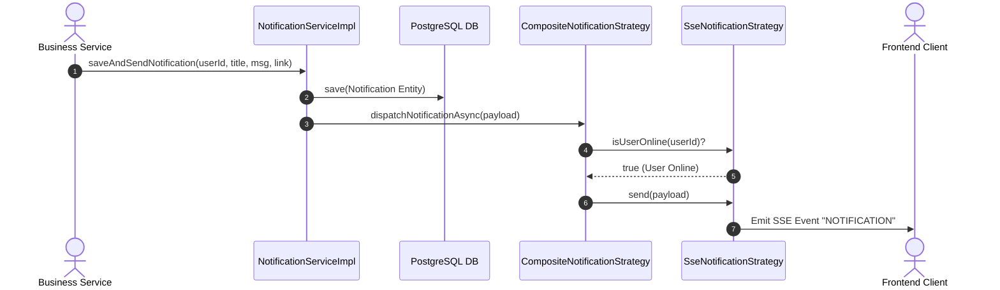
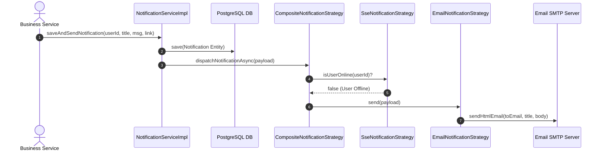

# Specification: Strategy Pattern Phase 2 - Multi-channel Notification Strategy (`MathClass-service`)

---

## 1. Feature Info
- **Feature Name:** Strategy Pattern Phase 2 - Multi-channel Notification Strategy (Phân phối thông báo đa kênh)
- **Jira Ticket:** [MAT-343](https://phanvanluan611996.atlassian.net/browse/MAT-343)
- **Target Subsystem:** `MathClass-service` (Backend Microservice - Java 21 / Spring Boot 3.4+)
- **Target Users:** Teachers (Giáo viên), Students (Học sinh), System Administrators

---

## 2. Business Goal (Mục Tiêu Nghiệp Vụ)
Hệ thống MathClass cần phát các thông báo quan trọng (Giao bài tập mới, Kết quả chấm bài AI, Cập nhật trạng thái lớp học, Báo cáo lỗi) đến người dùng theo thời gian thực hoặc qua thư điện tử. 

Trước đây, `NotificationServiceImpl` trực tiếp quản lý kết nối `SseEmitter` và gọi `EmailService` một cách thủ công, gây ra hiện tượng God Class, vi phạm Nguyên tắc Đơn trách nhiệm (SRP) và Mở/Đóng (OCP), đồng thời khó mở rộng thêm kênh thông báo mới trong tương lai.

Giai đoạn Phase 2 giải quyết các mục tiêu cốt lõi:
1. **Tái cấu trúc theo Strategy Pattern:** Phân tách hoàn toàn trách nhiệm lưu trữ DB, quản lý kết nối Web SSE Stream (`SseNotificationStrategy`) và phát thông báo qua Email (`EmailNotificationStrategy`).
2. **Luồng Điều Phối Thông Minh (Smart Composite Fallback Routing):** Tự động kiểm tra trạng thái kết nối realtime của người dùng:
   - Nếu **Online** (người dùng đang mở giao diện web có SSE Connection active): Phát sự kiện tức thì qua Web SSE Stream.
   - Nếu **Offline** (người dùng không có kết nối SSE): Tự động Fallback sang gửi Email thông báo.
3. **Tuyệt Đối Giữ Nguyên API Contract:** Giữ nguyên 100% các REST Endpoints (`/api/v1/notifications/stream`, `/api/v1/notifications`) phía Frontend.
4. **Xử Lý Bất Đồng Bộ (`@Async` Execution):** Quá trình gửi thông báo chạy bất đồng bộ trên thread pool riêng, trả về phản hồi HTTP tức thì cho thread nghiệp vụ chính.
5. **Đảm Bảo An Toàn & Chuẩn Hóa Email:** Tự động bổ sung domain prefix cho các relative link (`FRONTEND_URL`) và tận dụng khả năng tự động escape XSS của Thymeleaf.

---

## 3. Functional Requirements (Yêu Cầu Chức Năng)

- **FR-1 (Strategy Pattern Refactoring):**
  - Định nghĩa interface chuẩn `NotificationStrategy` với các phương thức `send(payload)`, `supports(channel)`, và default method `isUserOnline(userId)`.
  - Triển khai 3 strategies cụ thể: `SseNotificationStrategy`, `EmailNotificationStrategy`, và `CompositeNotificationStrategy`.
- **FR-2 (SSE Stream Lifecycle & Connection Management):**
  - `SseNotificationStrategy` quản lý tập trung danh sách `SseEmitter` trong `ConcurrentHashMap<Long, List<SseEmitter>>`.
  - Tự động đăng ký các callback `onCompletion`, `onTimeout`, `onError` để dọn dẹp các emitter bị đóng hoặc hỏng khỏi bộ nhớ RAM.
  - Phương thức `isUserOnline(userId)` trả về `true` khi danh sách emitter của user khác `null` và không rỗng.
- **FR-3 (Email Notification & Template Rendering):**
  - `EmailNotificationStrategy` tiếp nhận payload thông báo, render giao diện HTML qua Thymeleaf template và gửi thư điện tử qua `EmailService`.
  - Tự động chuẩn hóa relative link (ví dụ `/assignments/1`) thành absolute link (ví dụ `http://localhost:3000/assignments/1`) sử dụng giá trị cấu hình `@Value("${FRONTEND_URL:http://localhost:3000}")`.
  - Tránh escape HTML 2 lần bằng cách truyền trực tiếp dữ liệu thô vào context Thymeleaf (do Thymeleaf `th:text` đã có cơ chế tự động escape bảo vệ chống XSS).
- **FR-4 (Smart Fallback Routing via Composite Strategy):**
  - `CompositeNotificationStrategy` kiểm tra `sseStrategy.isUserOnline(recipientId)`.
  - Nếu user online ➔ Gọi `sseStrategy.send(payload)`.
  - Nếu user offline ➔ Gọi `emailStrategy.send(payload)`.
- **FR-5 (Facade Delegation & Non-blocking Dispatch):**
  - `NotificationServiceImpl` đóng vai trò Facade: lưu bản ghi `Notification` vào cơ sở dữ liệu PostgreSQL trước, sau đó ủy quyền việc phân phối bất đồng bộ cho `CompositeNotificationStrategy` via `@Async`.

---

## 4. Business Rules (Quy Tắc Nghiệp Vụ)

- **BR-1 (100% Backward Compatibility):**
  - Giữ nguyên toàn bộ cấu trúc bảng `notifications` trong cơ sở dữ liệu và các API Endpoints hiện tại của Frontend.
- **BR-2 (Channel Resolution Rule):**
  - Enum `NotificationChannel` bao gồm: `SSE`, `EMAIL`, `COMPOSITE`.
  - Mặc định các thông báo hệ thống tạo ra từ bài tập, AI job, báo cáo lỗi sẽ sử dụng kênh `COMPOSITE` để tối ưu trải nghiệm người dùng (Realtime khi online, Email khi offline).
- **BR-3 (Safe Exception Containment for Email):**
  - Lỗi phát sinh trong quá trình gửi Email (`MessagingException`, `MailException`) phải được bắt lại và ghi log cảnh báo (`log.error`), tuyệt đối không được ném ngoại lệ làm ảnh hưởng đến luồng chính hoặc tác vụ ngầm.
- **BR-4 (Absolute Link Requirement in Emails):**
  - Mọi đường dẫn liên kết trong email gửi đến client phải là Absolute URL (có chứa prefix `http://` hoặc `https://`) để người dùng có thể nhấp chuột trực tiếp từ các trình đọc thư (Gmail, Outlook).
- **BR-5 (Clean Memory & No Emitter Leak):**
  - Mọi kết nối SSE khi ngắt kết nối hoặc hết thời gian chờ phải được dọn dẹp khỏi `ConcurrentHashMap` để tránh rò rỉ bộ nhớ (Memory Leak).

---

## 5. Architecture Overview & Sequence Diagrams

### 5.1. Bức Tranh Kiến Trúc (Architecture Overview)

```mermaid
graph TD
    UserClient[Web Frontend / Client] -->|1. SSE Stream /api/v1/notifications/stream| SseStrategy[SseNotificationStrategy]
    BusinessService[Service Layer e.g. Assignment/AiJob] -->|2. saveAndSendNotification| NotificationFacade[NotificationServiceImpl Facade]
    NotificationFacade -->|3. Save DB| NotificationRepo[(PostgreSQL Notification)]
    NotificationFacade -->|4. @Async Dispatch| CompositeStrategy[CompositeNotificationStrategy]
    
    CompositeStrategy -->|5. Check isUserOnline?| SseStrategy
    SseStrategy -- Yes (User Online) -->|6a. Send SSE Event| UserClient
    SseStrategy -- No (User Offline) -->|6b. Fallback Trigger| EmailStrategy[EmailNotificationStrategy]
    EmailStrategy -->|7. Send HTML Email| SmtpServer[Gmail SMTP Server]
```

---

### 5.2. Sequence Diagram - Luồng Người Dùng Online (Web SSE Stream)



---

### 5.3. Sequence Diagram - Luồng Người Dùng Offline (Fallback sang Email)



---

## 6. Package Structure & Architectural Components

```
com.codegym.mathclass/
└── notification/
    ├── controller/
    │   └── NotificationController.java           # Endpoint SSE stream & REST API tra cứu
    ├── dto/
    │   ├── NotificationChannel.java              # Enum: SSE, EMAIL, COMPOSITE
    │   ├── NotificationPayload.java              # Record chứa dữ liệu phát thông báo
    │   └── NotificationResponse.java             # DTO trả về cho Frontend
    ├── entity/
    │   └── Notification.java                     # JPA Entity lưu bảng notifications
    ├── repository/
    │   └── NotificationRepository.java           # Spring Data JPA Repository
    ├── service/
    │   ├── NotificationService.java              # Business Interface chính
    │   └── impl/
    │       └── NotificationServiceImpl.java      # Facade Service & Dispatcher
    └── strategy/
        ├── NotificationStrategy.java             # Core Strategy Interface
        ├── SseNotificationStrategy.java          # SSE Stream Delivery Strategy
        ├── EmailNotificationStrategy.java        # Email Delivery Strategy
        └── CompositeNotificationStrategy.java    # Smart Fallback Router Strategy
```

---

## 7. Data Transfer Objects (DTO Schemas) & Enums

### 7.1. Enum Kênh Thông Báo (`NotificationChannel`)
```java
package com.codegym.mathclass.notification.dto;

public enum NotificationChannel {
    SSE,
    EMAIL,
    COMPOSITE
}
```

### 7.2. Payload Thông Báo (`NotificationPayload`)
```java
package com.codegym.mathclass.notification.dto;

public record NotificationPayload(
        Long recipientId,
        String title,
        String message,
        String link,
        String eventName,
        Object data
) {}
```

---

## 8. Core Interfaces & Strategy Implementation Specification

### 8.1. Strategy Interface (`NotificationStrategy`)
```java
package com.codegym.mathclass.notification.strategy;

import com.codegym.mathclass.notification.dto.NotificationChannel;
import com.codegym.mathclass.notification.dto.NotificationPayload;

public interface NotificationStrategy {
    void send(NotificationPayload payload);
    boolean supports(NotificationChannel channel);
    
    default boolean isUserOnline(Long userId) {
        return false;
    }
}
```

### 8.2. Web SSE Strategy (`SseNotificationStrategy`)
- Quản lý bộ nhớ tạm `ConcurrentHashMap<Long, List<SseEmitter>>`.
- Hàm `isUserOnline(userId)` xác định trạng thái kết nối trực tuyến của người dùng.
- Tự động gỡ bỏ emitter khi ngắt kết nối (`onCompletion`, `onTimeout`, `onError`).

### 8.3. Email Strategy (`EmailNotificationStrategy`)
- Nhận cấu hình `FRONTEND_URL` để chuyển hóa đường dẫn tương đối thành tuyệt đối.
- Sử dụng Thymeleaf context truyền chuỗi gốc, không qua escape HTML thủ công.
- Bắt và ghi log ngoại lệ an toàn, đảm bảo ứng dụng không crash khi SMTP server gặp sự cố.

### 8.4. Composite Fallback Strategy (`CompositeNotificationStrategy`)
- Thực hiện kiểm tra `isUserOnline`.
- Điều hướng động sang `SseNotificationStrategy` nếu Online hoặc `EmailNotificationStrategy` nếu Offline.

---

## 9. Non-Functional Requirements (NFR)

- **Performance & Latency:** Phương thức phát thông báo phải thực thi bất đồng bộ (`@Async`), không làm tăng thời gian phản hồi của các tác vụ nghiệp vụ chính.
- **Memory Safety:** Toàn bộ `SseEmitter` phải được đăng ký đầy đủ các callback dọn dẹp để phòng tránh rò rỉ RAM khi người dùng ngắt kết nối hoặc đóng trình duyệt.
- **Security & XSS Prevention:** Tận dụng khả năng escape tự động của Thymeleaf engine đối với nội dung thông báo động.
- **Maintainability:** Thiết kế mở rộng theo chuẩn Open/Closed Principle. Việc bổ sung kênh mới (như Zalo ZNS, Telegram) chỉ cần tạo mới 1 class triển khai `NotificationStrategy` mà không làm thay đổi các class hiện có.

---

## 10. Decision Log (Nhật Ký Quyết Định Kiến Trúc)

| Quyết định | Giải pháp Lựa chọn | Rationale (Lý do chọn) |
| :--- | :--- | :--- |
| **Mô hình Kiến trúc** | **Facade + Strategy Pattern** | Tách bạch hoàn toàn giữa việc lưu DB và phân phối thông báo. Giúp codebase tuân thủ OCP/SRP. |
| **Kênh Thông báo Mặc định** | **Composite Strategy** | Tối ưu trải nghiệm realtime khi user online và gửi mail nhắc nhở khi user offline, không làm spam hòm thư. |
| **Xử lý Bất đồng bộ** | **Spring `@Async` Execution** | Đảm bảo hiệu năng API chính (Nộp bài, Chấm điểm AI) không bị nghẽn bởi I/O mạng của Email/SSE. |
| **Xử lý Đường dẫn Mail** | **Domain Prefix Injection** | Đảm bảo liên kết trong email gửi đến người dùng luôn mở được trực tiếp từ Gmail/Outlook. |

---

## 11. Verification Checklist (Backend Testing)

```bash
# 1. Kiểm tra biên dịch Java toàn bộ hệ thống
./gradlew compileJava

# 2. Chạy Unit Test Suites cho Notification Subsystem
./gradlew test --tests "com.codegym.mathclass.notification.strategy.*" --tests "com.codegym.mathclass.notification.service.*"

# 3. Chạy toàn bộ Test Suite của hệ thống
./gradlew test
```
