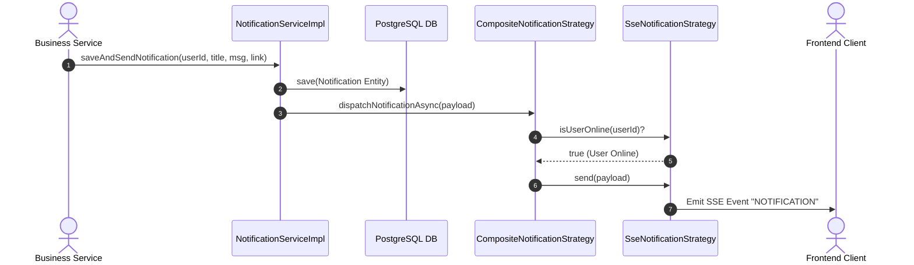
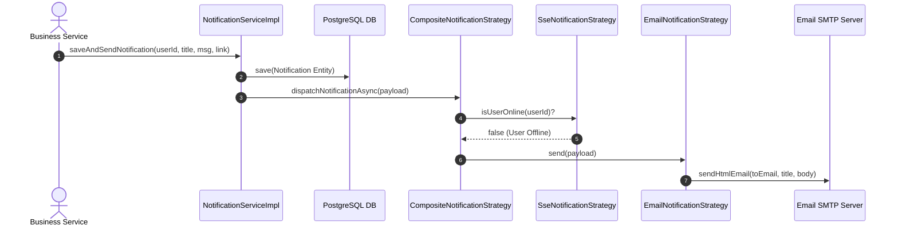

# Specification: Strategy Pattern Phase 2 — Multi-channel Notification Strategy (`MathClass-service`)

---

## 1. Feature Overview
- **Feature Name:** Strategy Pattern Phase 2 — Multi-channel Notification Strategy (Phân phối thông báo đa kênh)
- **Jira Ticket:** [MAT-343](https://phanvanluan611996.atlassian.net/browse/MAT-343)
- **Target Subsystems:** `MathClass-service` (Backend Microservice — Java 21 / Spring Boot 4.x+)
- **Target Users:** Teachers (Giáo viên), Students (Học sinh), System Administrators

---

## 2. Business Goal & Core Objectives

Hệ thống MathClass cần phát các thông báo quan trọng (Giao bài tập mới, Kết quả chấm bài AI, Cập nhật trạng thái lớp học, Báo cáo lỗi) đến người dùng theo thời gian thực hoặc qua thư điện tử.

Trước đây, `NotificationServiceImpl` trực tiếp quản lý kết nối `SseEmitter` và gọi `EmailService` một cách thủ công, gây ra hiện tượng God Class, vi phạm Nguyên tắc Đơn trách nhiệm (SRP) và Mở/Đóng (OCP), đồng thời khó mở rộng thêm kênh thông báo mới trong tương lai.

Thay thế mô hình thông báo thủ công bằng **kiến trúc Strategy Pattern & Smart Composite Fallback Routing**:

1. **Tái cấu trúc theo Strategy Pattern:** Phân tách hoàn toàn trách nhiệm lưu trữ DB và các kênh phân phối thông báo (`NotificationStrategy`, `SseNotificationStrategy`, `EmailNotificationStrategy`, `CompositeNotificationStrategy`).
2. **Luồng Điều Phối Thông Minh (Smart Composite Routing):** Tự động kiểm tra trạng thái kết nối realtime của người dùng:
   - **Online** (người dùng đang mở giao diện web có kết nối SSE active): Phát sự kiện tức thì qua Web SSE Stream.
   - **Offline** (người dùng không có kết nối SSE): Tự động Fallback sang gửi Email thông báo.
3. **Tuyệt Đối Giữ Nguyên API Contract:** Giữ nguyên 100% các REST & SSE Endpoints (`/api/v1/notifications/stream`, `/api/v1/notifications`) phía Frontend.
4. **Xử Lý Bất Đồng Bộ (`@Async` Execution):** Lưu DB đồng bộ, quá trình gửi thông báo chạy bất đồng bộ trên thread pool riêng, trả về phản hồi HTTP tức thì cho thread nghiệp vụ chính.
5. **Đảm Bảo An Toàn & Chuẩn Hóa Email:** Tự động bổ sung domain prefix cho các relative link (`FRONTEND_URL`) và tận dụng khả năng tự động escape XSS của Thymeleaf.

Bảng ánh xạ kênh thông báo theo trạng thái (Channel Routing Table):

| NotificationChannel | Trạng thái User | Hành động hệ thống | Trải nghiệm người dùng |
| :--- | :--- | :--- | :--- |
| `SSE` | Online | Đẩy event SSE realtime | Popup/Toast thông báo trên web |
| `EMAIL` | Online / Offline | Gửi HTML Email qua SMTP | Email nhận trong Hòm thư |
| `COMPOSITE` (Mặc định) | **Online** | Đẩy event SSE realtime | Nhận ngay tức thì trên giao diện web |
| `COMPOSITE` (Mặc định) | **Offline** | Fallback gửi HTML Email | Nhận email thư điện tử trong Hòm thư |

---

## 3. Potential Logic Loopholes & Mitigations (6 Key Edge Cases)

### 3.1. Case 1: Rò rỉ bộ nhớ (Memory Leak) do kết nối SSE bị treo hoặc ngắt đột ngột
- **Vấn đề:** Client đóng tab, rớt mạng hoặc ngắt kết nối đột ngột mà server vẫn giữ `SseEmitter` trong bộ nhớ RAM → gây rò rỉ RAM và báo sai trạng thái `isUserOnline=true`.
- **Khắc phục:** Đăng ký đầy đủ 3 callback lifecycle (`onCompletion`, `onTimeout`, `onError`) để chủ động gỡ emitter khỏi map. Hàm `isUserOnline(userId)` kiểm tra danh sách emitter rỗng hoặc hỏng.

### 3.2. Case 2: Double HTML Escaping trong Email Body & Relative Links
- **Vấn đề:** Tự escape HTML thủ công trước khi truyền vào Thymeleaf làm xuất hiện HTML entities (như `&amp;`, `&lt;`) trên nội dung email của người dùng.
- **Khắc phục:** Truyền dữ liệu thô vào context Thymeleaf, để Thymeleaf `th:text` tự động escape XSS an toàn khi render template.

### 3.3. Case 3: Link tương đối (`/assignments/1`) bị hỏng khi người dùng mở trong Email
- **Vấn đề:** Đường dẫn tương đối hoạt động tốt trên Web SSE nhưng khi vào Gmail/Outlook click không mở được vì thiếu domain host.
- **Khắc phục:** `EmailNotificationStrategy` tự động kiểm tra đường dẫn bắt đầu bằng `/` và nối thêm prefix `@Value("${FRONTEND_URL:http://localhost:3000}")` chuyển relative path thành Absolute URL.

### 3.4. Case 4: Lỗi phát thư SMTP làm gián đoạn luồng nghiệp vụ hoặc nghẽn Async Thread
- **Vấn đề:** Server mail gặp sự cố (timeout, 5xx SMTP) → ném `MailException` làm crash ngầm async task hoặc log spam unhandled exception.
- **Khắc phục:** `EmailNotificationStrategy` bọc `try-catch` xung quanh lệnh gửi mail, ghi log cảnh báo `log.error` và không ném lại ngoại lệ (Safe Exception Containment).

### 3.5. Case 5: Race Condition khi kiểm tra `isUserOnline` tại thời điểm User ngắt kết nối
- **Vấn đề:** Client vừa đóng tab đúng lúc event phát đến, `isUserOnline` trả về `true` nhưng `emitter.send()` bị ném `IOException`.
- **Khắc phục:** `SseNotificationStrategy.send()` bắt `IOException` / `IllegalStateException`, loại bỏ emitter hỏng khỏi RAM và chuyển hướng fallback mượt mà.

### 3.6. Case 6: ConcurrentModificationException khi nhiều thread thao tác danh sách `SseEmitter`
- **Vấn đề:** Thread phát event đang duyệt danh sách emitter, thread khác nhận callback `onCompletion` dọn dẹp làm phát sinh lỗi xung đột bộ nhớ.
- **Khắc phục:** Quản lý danh sách emitter bằng `CopyOnWriteArrayList` hoặc `Collections.synchronizedList` kết hợp kiểm tra emitter active trước khi emit.

---

## 4. Functional Requirements

- **FR-1 (Strategy Pattern Structure):** Định nghĩa interface chuẩn `NotificationStrategy` với các phương thức `send(payload)`, `supports(channel)`, và default method `isUserOnline(userId)`. Triển khai 3 strategies cụ thể: `SseNotificationStrategy`, `EmailNotificationStrategy`, và `CompositeNotificationStrategy`.
- **FR-2 (SSE Stream Lifecycle & Connection Management):** `SseNotificationStrategy` quản lý tập trung danh sách `SseEmitter` trong `ConcurrentHashMap<Long, List<SseEmitter>>`. Tự động đăng ký callback `onCompletion`, `onTimeout`, `onError` để dọn dẹp các emitter bị ngắt kết nối.
- **FR-3 (Email Notification & Template Normalization):** `EmailNotificationStrategy` tiếp nhận payload, render giao diện HTML qua Thymeleaf template và gửi thư điện tử qua `EmailService`. Tự động chuẩn hóa relative link thành absolute link với `@Value("${FRONTEND_URL:http://localhost:3000}")`.
- **FR-4 (Smart Fallback Routing via Composite Strategy):** `CompositeNotificationStrategy` kiểm tra `sseStrategy.isUserOnline(recipientId)`. Nếu user online ➔ Gọi `sseStrategy.send(payload)`. Nếu user offline ➔ Gọi `emailStrategy.send(payload)`.
- **FR-5 (Facade Delegation & Non-blocking Dispatch):** `NotificationServiceImpl` đóng vai trò Facade: lưu bản ghi `Notification` vào PostgreSQL trước, sau đó ủy quyền việc phân phối bất đồng bộ cho `CompositeNotificationStrategy` via `@Async`.
- **FR-6 (REST & SSE API Contract Consistency):** Giữ nguyên 100% các API endpoints `/api/v1/notifications/stream` và `/api/v1/notifications` hiện có cho Frontend.

---

## 5. Business Rules

- **BR-1 (100% Backward Compatibility):** Giữ nguyên toàn bộ cấu trúc bảng `notifications` trong cơ sở dữ liệu PostgreSQL và các REST API Endpoints hiện tại của Frontend.
- **BR-2 (Channel Resolution Rule):** Enum `NotificationChannel` bao gồm: `SSE`, `EMAIL`, `COMPOSITE`. Mặc định các thông báo hệ thống tạo ra từ bài tập, AI job, báo cáo lỗi sử dụng kênh `COMPOSITE`.
- **BR-3 (Safe Exception Containment for Email):** Lỗi phát sinh trong quá trình gửi Email (`MessagingException`, `MailException`) phải được bắt lại và ghi log cảnh báo (`log.error`), tuyệt đối không ném ngoại lệ làm ảnh hưởng luồng chính.
- **BR-4 (Absolute Link Requirement in Emails):** Mọi đường dẫn liên kết trong email gửi đến client phải là Absolute URL (có chứa prefix `http://` hoặc `https://`) để mở trực tiếp từ Gmail/Outlook.
- **BR-5 (Clean Memory & No Emitter Leak):** Mọi kết nối SSE khi ngắt kết nối hoặc hết thời gian chờ phải được dọn dẹp khỏi `ConcurrentHashMap` để tránh rò rỉ bộ nhớ (Memory Leak).
- **BR-6 (DB Persistence First):** Bản ghi `Notification` phải được lưu vào DB thành công trước khi tiến hành phân phối bất đồng bộ qua các kênh strategy.
- **BR-7 (Async Execution Isolation):** Quá trình dispatch thông báo được thực thi bất đồng bộ trên thread pool riêng (`@Async`), không được làm tăng latency của thread HTTP chính.

---

## 6. Data Model & Package Structure

> `spring.jpa.hibernate.ddl-auto=update` → Kế thừa `BaseEntity` (`id`, `created_at`, `updated_at`). Bảng `notifications` được giữ nguyên schema.

### 6.1. Entity Schema — Bảng `notifications`
- **Java Class:** `com.codegym.mathclass.notification.entity.Notification extends BaseEntity`

```sql
CREATE TABLE notifications (
    id BIGSERIAL PRIMARY KEY,
    user_id BIGINT NOT NULL REFERENCES users(id),
    title VARCHAR(255) NOT NULL,
    message TEXT NOT NULL,
    link VARCHAR(500),
    is_read BOOLEAN NOT NULL DEFAULT FALSE,
    created_at TIMESTAMP,
    updated_at TIMESTAMP
);

CREATE INDEX idx_notification_user_read ON notifications(user_id, is_read, created_at DESC);
```

### 6.2. Package Layout Structure

```
com.codegym.mathclass/
└── notification/
    ├── controller/
    │   └── NotificationController.java           # Endpoint SSE stream & REST API tra cứu
    ├── dto/
    │   ├── NotificationChannel.java              # Enum: SSE, EMAIL, COMPOSITE
    │   ├── NotificationPayload.java              # Record chứa dữ liệu phát thông báo
    │   └── NotificationResponse.java             # DTO trả về cho Frontend
    ├── entity/
    │   └── Notification.java                     # JPA Entity lưu bảng notifications
    ├── repository/
    │   └── NotificationRepository.java           # Spring Data JPA Repository
    ├── service/
    │   ├── NotificationService.java              # Business Interface chính
    │   └── impl/
    │       └── NotificationServiceImpl.java      # Facade Service & Async Dispatcher
    └── strategy/
        ├── NotificationStrategy.java             # Core Strategy Interface
        ├── SseNotificationStrategy.java          # SSE Stream Delivery Strategy
        ├── EmailNotificationStrategy.java        # Email Delivery Strategy
        └── CompositeNotificationStrategy.java    # Smart Fallback Router Strategy
```

---

## 7. API Contract & DTO Schemas

> Prefix: `/api/v1`. Chuẩn phản hồi: `ApiResponse<T>`.

### 7.1. Enum Kênh Thông Báo (`NotificationChannel`)
```java
package com.codegym.mathclass.notification.dto;

public enum NotificationChannel {
    SSE,
    EMAIL,
    COMPOSITE
}
```

### 7.2. Payload Thông Báo (`NotificationPayload`)
```java
package com.codegym.mathclass.notification.dto;

public record NotificationPayload(
        Long recipientId,
        String title,
        String message,
        String link,
        String eventName,
        Object data
) {}
```

### 7.3. Realtime SSE Stream Endpoint
- **Endpoint:** `GET /api/v1/notifications/stream?token={jwtToken}`
- **Authorization:** `isAuthenticated()` (JWT Token)
- **Response Format:** `text/event-stream`
- **Event Header:** `event: NOTIFICATION`
- **Event Data JSON:**
```json
{
  "id": 105,
  "title": "Bài tập mới",
  "message": "Bạn có bài tập đại số mới cần hoàn thành.",
  "link": "/student/assignments/42",
  "isRead": false,
  "createdAt": "2026-09-08T08:30:00Z"
}
```

### 7.4. Rest API — Danh sách thông báo
- **Endpoint:** `GET /api/v1/notifications?page=0&size=20`
- **Response `200 OK`:**
```json
{
  "code": 200,
  "data": {
    "content": [
      {
        "id": 105,
        "title": "Bài tập mới",
        "message": "Bạn có bài tập đại số mới cần hoàn thành.",
        "link": "/student/assignments/42",
        "isRead": false,
        "createdAt": "2026-09-08T08:30:00Z"
      }
    ],
    "page": 0,
    "size": 20,
    "totalElements": 1,
    "totalPages": 1
  }
}
```

### 7.5. Rest API — Đánh dấu đã đọc
- **Endpoint:** `PUT /api/v1/notifications/{id}/read`
- **Response `200 OK`:** `{ "code": 200, "message": "Đã đánh dấu đọc thông báo thành công" }`

---

## 8. Architecture Overview & Sequence Diagrams

### 8.1. Bức Tranh Kiến Trúc (Architecture Overview)

```mermaid
graph TD
    UserClient[Web Frontend / Client] -->|1. SSE Stream /api/v1/notifications/stream| SseStrategy[SseNotificationStrategy]
    BusinessService[Service Layer e.g. Assignment/AiJob] -->|2. saveAndSendNotification| NotificationFacade[NotificationServiceImpl Facade]
    NotificationFacade -->|3. Save DB| NotificationRepo[(PostgreSQL Notification)]
    NotificationFacade -->|4. @Async Dispatch| CompositeStrategy[CompositeNotificationStrategy]
    
    CompositeStrategy -->|5. Check isUserOnline?| SseStrategy
    SseStrategy -- Yes (User Online) -->|6a. Send SSE Event| UserClient
    SseStrategy -- No (User Offline) -->|6b. Fallback Trigger| EmailStrategy[EmailNotificationStrategy]
    EmailStrategy -->|7. Send HTML Email| SmtpServer[Gmail SMTP Server]
```

---

### 8.2. Sequence Diagram — Luồng Người Dùng Online (Web SSE Stream)



---

### 8.3. Sequence Diagram — Luồng Người Dùng Offline (Fallback sang Email)



---

## 9. Core Interfaces & Strategy Pattern Specification

### 9.1. Core Interface (`NotificationStrategy`)

```java
package com.codegym.mathclass.notification.strategy;

import com.codegym.mathclass.notification.dto.NotificationChannel;
import com.codegym.mathclass.notification.dto.NotificationPayload;

public interface NotificationStrategy {
    void send(NotificationPayload payload);
    boolean supports(NotificationChannel channel);
    
    default boolean isUserOnline(Long userId) {
        return false;
    }
}
```

### 9.2. Realtime SSE Strategy (`SseNotificationStrategy`)
- Duy trì `ConcurrentHashMap<Long, List<SseEmitter>>`.
- Hàm `isUserOnline(userId)` trả về `true` khi danh sách emitter khả dụng khác rỗng.
- Đăng ký `onCompletion`, `onTimeout`, `onError` dọn dẹp bộ nhớ RAM tự động.

### 9.3. Email Strategy (`EmailNotificationStrategy`)
- Nhận diện relative link và gắn prefix `FRONTEND_URL`.
- Render HTML qua Thymeleaf template, truyền trực tiếp biến thô vào context.
- Bọc try-catch bắt lỗi `MailException` để không ngắt luồng bất đồng bộ.

### 9.4. Composite Router Strategy (`CompositeNotificationStrategy`)
- Kiểm tra `sseStrategy.isUserOnline(recipientId)`.
- Online ➔ `sseStrategy.send(payload)`.
- Offline ➔ `emailStrategy.send(payload)`.

### 9.5. Facade Service (`NotificationServiceImpl`)
- `saveAndSendNotification(...)`: Lưu bản ghi `Notification` vào DB trước.
- Gọi `@Async` dispatch thông báo qua `CompositeNotificationStrategy`.

---

## 10. Non-Functional Requirements & Implementation Constraints

- **Framework:** Java 21 LTS, Spring Boot 4.x (Spring Framework 6.x), Spring Data JPA.
- **Performance & Latency:** Dispatch bất đồng bộ (`@Async`), không ảnh hưởng đến HTTP response time của tác vụ chính.
- **Memory Safety:** Toàn bộ `SseEmitter` đăng ký dọn dẹp qua lifecycle callbacks, phòng chống Memory Leak trên RAM.
- **Security & XSS:** Tự động escape dữ liệu khi render HTML mail với Thymeleaf; kiểm tra xác thực JWT khi kết nối SSE stream.
- **Maintainability & Extensibility:** Tuân thủ Open/Closed Principle (OCP). Thêm kênh mới (như Zalo, Telegram) chỉ cần tạo class mới triển khai `NotificationStrategy` mà không sửa đổi codebase hiện tại.

---

## 11. Acceptance Criteria Checklist

- [x] **AC-1 (Refactoring Strategy):** Phân tách thành công SSE, Email, và Composite router dựa trên `NotificationStrategy`.
- [x] **AC-2 (Luồng User Online):** Người dùng đang online nhận thông báo ngay lập tức qua Web SSE Stream, không phát mail rác.
- [x] **AC-3 (Luồng User Offline):** Người dùng không có kết nối SSE tự động chuyển hướng gửi thông báo qua HTML Email.
- [x] **AC-4 (Quản lý kết nối SSE):** Thiết lập kết nối `SseEmitter` ổn định, tự động dọn dẹp emitter ngắt kết nối/timeout khỏi RAM.
- [x] **AC-5 (Chuẩn hóa Đường dẫn Mail):** Relative link trong mail được tự động bổ sung prefix `FRONTEND_URL` thành Absolute URL.
- [x] **AC-6 (Xử lý lỗi Email an toàn):** Lỗi SMTP không ném exception ra ngoài, không làm crash luồng bất đồng bộ hoặc hỏng dữ liệu DB.
- [x] **AC-7 (Backward Compatibility):** Giữ nguyên 100% REST APIs `/api/v1/notifications` và cấu hình bảng `notifications`.
- [x] **AC-8 (Async Non-blocking):** Gửi thông báo bất đồng bộ (`@Async`), API chính phản hồi tức thì.
- [x] **AC-9 (Phòng chống XSS & Double Escaping):** Dữ liệu truyền vào email render an toàn, không bị lặp escape HTML entity.
- [x] **AC-10 (Đa kết nối Concurrent):** Người dùng mở nhiều tab cùng lúc nhận đầy đủ SSE notification trên tất cả các tab.
- [x] **AC-11 (Cập nhật trạng thái tức thì):** Khi ngắt tất cả tab web, `isUserOnline` trả về `false` ngay lập tức.
- [x] **AC-12 (Lưu DB trước khi gửi):** Mọi thông báo đều được lưu vết vào cơ sở dữ liệu PostgreSQL trước khi phát tin ngầm.

---

## 12. Unit & Integration Test Cases Checklist

### 12.1. Backend Unit Tests (`SseNotificationStrategyTest`, `EmailNotificationStrategyTest`, `CompositeNotificationStrategyTest`, `NotificationServiceImplTest`)
- [x] **UT-BE-01:** `isUserOnline_activeEmitter_shouldReturnTrue()`
- [x] **UT-BE-02:** `isUserOnline_noEmitterOrEmpty_shouldReturnFalse()`
- [x] **UT-BE-03:** `sseSend_activeConnection_shouldEmitSseEvent()`
- [x] **UT-BE-04:** `sseSend_brokenConnection_shouldRemoveEmitterAndNotThrow()`
- [x] **UT-BE-05:** `emailSend_relativeLink_shouldPrefixWithFrontendUrl()`
- [x] **UT-BE-06:** `emailSend_smtpError_shouldCatchAndLogWithoutThrowing()`
- [x] **UT-BE-07:** `compositeSend_userOnline_shouldDelegateToSseOnly()`
- [x] **UT-BE-08:** `compositeSend_userOffline_shouldDelegateToEmailOnly()`
- [x] **UT-BE-09:** `saveAndSend_shouldPersistToDbFirstThenAsyncDispatch()`
- [x] **UT-BE-10:** `sseLifecycle_onTimeoutOrError_shouldRemoveEmitterFromMap()`

### 12.2. Backend Integration Tests (`NotificationControllerIntegrationTest`)
- [x] **IT-BE-01:** `GET /api/v1/notifications/stream` thiết lập kết nối SSE thành công với JWT token hợp lệ.
- [x] **IT-BE-02:** `GET /api/v1/notifications` trả về danh sách thông báo phân trang chính xác cho user.
- [x] **IT-BE-03:** `PUT /api/v1/notifications/{id}/read` cập nhật đúng trạng thái `isRead = true` trong cơ sở dữ liệu.

---

## 13. Implementation Checklist

- [x] Định nghĩa enum `NotificationChannel` (`SSE`, `EMAIL`, `COMPOSITE`) và `NotificationPayload` record.
- [x] Định nghĩa interface `NotificationStrategy` (`send`, `supports`, `isUserOnline`).
- [x] Triển khai `SseNotificationStrategy` với `ConcurrentHashMap` và lifecycle callbacks.
- [x] Triển khai `EmailNotificationStrategy` với Thymeleaf HTML rendering và normalization `FRONTEND_URL`.
- [x] Triển khai `CompositeNotificationStrategy` cho smart fallback routing.
- [x] Cập nhật `NotificationServiceImpl` thành Facade Service kết hợp `@Async` dispatch.
- [x] Kiểm tra và giữ nguyên 100% API contract tại `NotificationController`.
- [x] Bổ sung Unit Tests & Integration Tests toàn bộ subsystem thông báo.
- [x] Kiểm tra biên dịch Java và xác nhận test suite vượt qua thành công.

