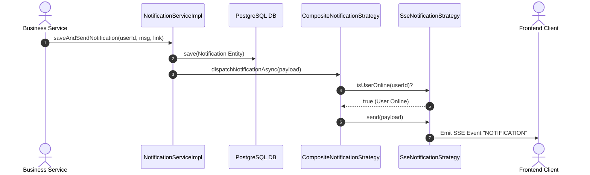
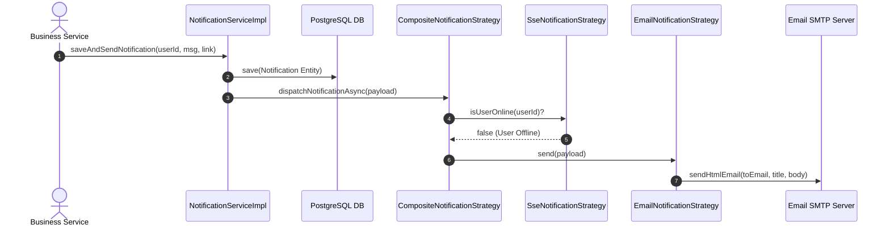

# Đặc tả Kỹ thuật: Strategy Pattern Phase 2 - Phân phối Thông báo Đa kênh (Notification Strategy)

Tài liệu đặc tả chi tiết kiến trúc, mô hình dữ liệu, luồng điều phối và quy chuẩn kiểm thử cho hệ thống **Multi-channel Notification System** áp dụng **Strategy Pattern** trong dự án `MathClass-service`.

---

## 1. Bối cảnh & Mục tiêu Kỹ thuật

### 1.1. Bối cảnh
Hệ thống MathClass cần phát các thông báo quan trọng (Giao bài tập mới, Kết quả chấm bài AI, Cập nhật trạng thái lớp học, Báo cáo lỗi) đến người dùng. Hiện tại, `NotificationServiceImpl` trực tiếp quản lý `SseEmitter` và gọi `EmailService` một cách thủ công, làm tăng độ phức tạp (God Class) và khó mở rộng các kênh thông báo mới (Telegram, Push Notification).

### 1.2. Mục tiêu Phase 2
- **Tái cấu trúc theo Strategy Pattern:** Phân tách hoàn toàn trách nhiệm giữa việc lưu Database, quản lý kết nối SSE Stream và gửi Email.
- **Smart Fallback Routing (Composite Strategy):** Tự động phát hiện trạng thái kết nối của người dùng:
  - Nếu **Online** (đang mở Web có SSE connection active) ➔ Phát tin tức thời qua Web SSE Stream.
  - Nếu **Offline** (không có SSE connection) ➔ Tự động kích hoạt luồng gửi Email thông báo.
- **Không làm vỡ API Contract:** Giữ nguyên 100% các REST Endpoints (`/api/v1/notifications/stream`, `/api/v1/notifications`) phía Frontend.
- **Xử lý Bất đồng bộ (Async Execution):** Gửi thông báo không làm nghẽn thread chính xử lý nghiệp vụ.

---

## 2. Bức tranh Kiến trúc (Architecture Overview)

```mermaid
graph TD
    UserClient[Web Frontend / Client] -->|1. SSE Stream /api/v1/notifications/stream| SseStrategy
    BusinessService[Service Layer e.g. Assignment/AiJob] -->|2. saveAndSendNotification| NotificationFacade[NotificationServiceImpl Facade]
    NotificationFacade -->|3. Save DB| NotificationRepo[(PostgreSQL Notification)]
    NotificationFacade -->|4. @Async Dispatch| CompositeStrategy[CompositeNotificationStrategy]
    
    CompositeStrategy -->|5. Check isUserOnline?| SseStrategy[SseNotificationStrategy]
    SseStrategy -- Yes (User Online) -->|6a. Send SSE Event| UserClient
    SseStrategy -- No (User Offline) -->|6b. Fallback Trigger| EmailStrategy[EmailNotificationStrategy]
    EmailStrategy -->|7. Send HTML Email| SmtpServer[Gmail SMTP Server]
```

---

## 3. Định nghĩa Mô hình Dữ liệu (Data Structures)

### 3.1. Kênh Thông báo (`com.codegym.mathclass.notification.dto.NotificationChannel`)
```java
package com.codegym.mathclass.notification.dto;

public enum NotificationChannel {
    SSE,
    EMAIL,
    COMPOSITE
}
```

### 3.2. Payload Thông báo (`com.codegym.mathclass.notification.dto.NotificationPayload`)
```java
package com.codegym.mathclass.notification.dto;

public record NotificationPayload(
        Long recipientId,
        String title,
        String message,
        String link,
        String eventName,
        Object data
) {}
```

---

## 4. Thiết kế Chi tiết Thành phần (Component Design)

### 4.1. Core Interface (`com.codegym.mathclass.notification.strategy.NotificationStrategy`)
```java
package com.codegym.mathclass.notification.strategy;

import com.codegym.mathclass.notification.dto.NotificationChannel;
import com.codegym.mathclass.notification.dto.NotificationPayload;

public interface NotificationStrategy {
    void send(NotificationPayload payload);
    boolean supports(NotificationChannel channel);
    
    default boolean isUserOnline(Long userId) {
        return false;
    }
}
```

---

### 4.2. Triển khai Web SSE Strategy (`SseNotificationStrategy`)
- **Trách nhiệm:** Quản lý tập trung danh sách `SseEmitter` (`ConcurrentHashMap<Long, List<SseEmitter>>`).
- **Logic `isUserOnline(userId)`:** Kiểm tra danh sách emitter của `userId` khác `null` và không rỗng (`!userEmitters.isEmpty()`).
- **Quản lý Vòng đời Emitter:** Tự động đăng ký callback `onCompletion`, `onTimeout`, `onError` để xóa emitter hỏng khỏi RAM.

```java
@Component("sseNotificationStrategy")
@Slf4j
public class SseNotificationStrategy implements NotificationStrategy {
    private final Map<Long, List<SseEmitter>> emitters = new ConcurrentHashMap<>();

    @Override
    public boolean supports(NotificationChannel channel) {
        return channel == NotificationChannel.SSE;
    }

    @Override
    public boolean isUserOnline(Long userId) {
        if (userId == null) return false;
        List<SseEmitter> userEmitters = emitters.get(userId);
        return userEmitters != null && !userEmitters.isEmpty();
    }

    @Override
    public void send(NotificationPayload payload) {
        // Gửi SSE Event
    }
}
```

---

### 4.3. Triển khai Email Strategy (`EmailNotificationStrategy`)
- **Trách nhiệm:** Format mẫu Email HTML và ủy quyền gửi qua `EmailService`.
- **Ngoại lệ:** Bắt lỗi `MessagingException` / `MailException` và ghi `@Slf4j log.error(...)` an toàn, không ném exception ra ngoài.

```java
@Component("emailNotificationStrategy")
@RequiredArgsConstructor
@Slf4j
public class EmailNotificationStrategy implements NotificationStrategy {
    private final EmailService emailService;

    @Override
    public boolean supports(NotificationChannel channel) {
        return channel == NotificationChannel.EMAIL;
    }

    @Override
    public void send(NotificationPayload payload) {
        // Format HTML & Gửi Mail
    }
}
```

---

### 4.4. Triển khai Composite Fallback Strategy (`CompositeNotificationStrategy`)
- **Trách nhiệm:** Điều phối luồng gửi thông minh dựa trên trạng thái kết nối của người dùng.

```java
@Component("compositeNotificationStrategy")
@RequiredArgsConstructor
@Slf4j
public class CompositeNotificationStrategy implements NotificationStrategy {
    private final SseNotificationStrategy sseStrategy;
    private final EmailNotificationStrategy emailStrategy;

    @Override
    public boolean supports(NotificationChannel channel) {
        return channel == NotificationChannel.COMPOSITE;
    }

    @Override
    public void send(NotificationPayload payload) {
        Long recipientId = payload.recipientId();
        if (sseStrategy.isUserOnline(recipientId)) {
            log.info("[Notification] User {} ONLINE -> Gửi qua SSE Stream", recipientId);
            sseStrategy.send(payload);
        } else {
            log.info("[Notification] User {} OFFLINE -> Fallback tự động sang Email", recipientId);
            emailStrategy.send(payload);
        }
    }
}
```

---

## 5. Luồng Thực thi (Sequence Diagrams)

### 5.1. Luồng Người dùng Online (Web SSE Stream)


### 5.2. Luồng Người dùng Offline (Fallback sang Email)


---

## 6. Yêu cầu Phi chức năng & Kiểm thử (NFR & Testing)

### 6.1. Hiệu năng & An toàn Bộ nhớ (Performance & Memory Safety)
- **Non-blocking Execution:** Mọi tác vụ phân phối thông báo phải chạy trong `@Async` Thread Pool để trả response HTTP tức thì cho người dùng.
- **Leak Prevention:** Đăng ký callback dọn dẹp `SseEmitter` rác trên mọi luồng kết nối.

### 6.2. Kế hoạch Kiểm thử Unit Test (Test Suite Specification)
1. **`SseNotificationStrategyTest`:** Kiểm thử tạo kết nối emitter, kiểm tra `isUserOnline()` trả về đúng khi có/không có emitter.
2. **`EmailNotificationStrategyTest`:** Kiểm thử format nội dung HTML và gọi `EmailService`.
3. **`CompositeNotificationStrategyTest`:**
   - Verify: Khi `isUserOnline` = true ➔ Gọi `SseStrategy`, KHÔNG gọi `EmailStrategy`.
   - Verify: Khi `isUserOnline` = false ➔ Gọi `EmailStrategy`, KHÔNG gọi `SseStrategy`.
4. **`NotificationServiceImplTest`:** Kiểm thử Facade lưu DB và ủy quyền gửi cho Strategy.

---

## 7. Nhật ký Quyết định Kiến trúc (Decision Log)

| Quyết định | Giải pháp Lựa chọn | Rationale (Lý do chọn) |
| :--- | :--- | :--- |
| **Mô hình Kiến trúc** | **Facade + Strategy Pattern** | Giảm độ phức tạp cho `NotificationServiceImpl`, tuân thủ OCP/SRP, sẵn sàng mở rộng kênh mới. |
| **Luồng Phân phối** | **Composite Fallback (SSE ➔ Email)** | Tối ưu trải nghiệm tức thì khi Online và tránh gửi Email thừa thải gây spammed hòm thư. |
| **Giao thức Thực thi** | **Spring `@Async` Execution** | Đảm bảo hiệu năng API chính (Nộp bài, Chấm điểm) không bị ảnh hưởng bởi độ trễ mạng khi gửi Email. |
