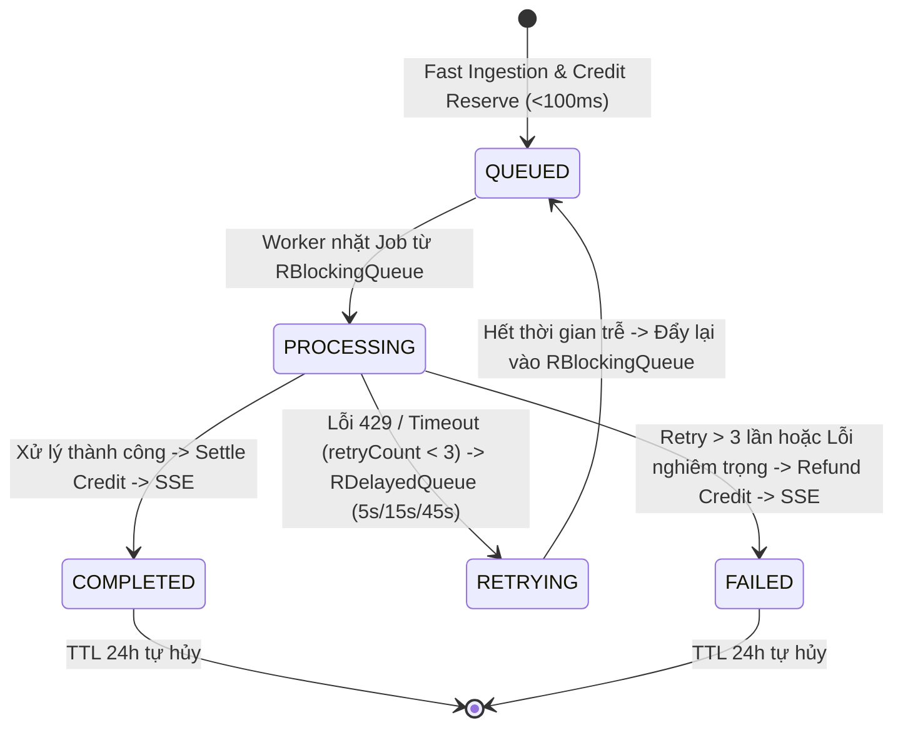
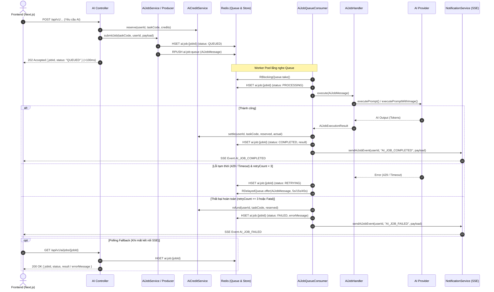

# Specification: Redis Queue & Redisson Async Job Processing for AI Subsystem (`MathClass-service`)

---

## 1. Feature Info
- **Feature Name:** Redis Queue & Redisson Async Job Processing for Distributed AI Tasks
- **Jira Ticket:** [MAT-346](https://phanvanluan611996.atlassian.net/browse/MAT-346)
- **Target Subsystem:** `MathClass-service` (Backend Microservice - Java 21 / Spring Boot 3.4+)
- **Target Users:** Teachers (Giáo viên), Students (Học sinh), System Administrators

---

## 2. Business Goal (Mục Tiêu Nghiệp Vụ)
Chuyển đổi toàn bộ các tác vụ AI nặng (Chấm điểm tự luận `SUBMISSION_GRADING`, OCR chữ viết tay `CANVAS_LATEX`, Sinh câu hỏi Toán đơn lẻ `QUESTION_GEN`, Tách đề hàng loạt từ file `BATCH_QUESTION_GEN`, Đánh giá tiến độ học sinh `STUDENT_REMARK`) từ mô hình Đồng bộ (Synchronous HTTP) sang mô hình Hàng đợi Bất đồng bộ Phân tán (Distributed Asynchronous Job Queue với Redis & Redisson).

Hệ thống giải quyết triệt để 5 vấn đề cốt lõi:
1. **Chống nghẽn Thread Tomcat (Thread Starvation):** Endpoint tiếp nhận phản hồi `202 Accepted` kèm `jobId` trong **< 100ms**, giải phóng worker thread ngay lập tức.
2. **Ngăn chặn Database Connection Leak & Lock Contention:** Không còn giữ kết nối HikariCP và `PESSIMISTIC_WRITE` lock trên tài khoản credit trong thời gian dài gọi LLM (15s – 60s).
3. **Kiểm soát Concurrency & Chống Quá Tải Quota (Throttling):** Worker pool giới hạn số tác vụ AI chạy song song (mặc định 3–5 concurrency), tránh bị lỗi HTTP 429 Too Many Requests từ các Provider (Gemini, OpenAI).
4. **Cơ chế Chịu Lỗi & Thử Lại Thông Minh (Smart Retry with Exponential Backoff):** Tự động thử lại qua `RDelayedQueue` (5s ➔ 15s ➔ 45s) khi gặp lỗi mạng/quota, tự động xoay API Key qua `KeySelectionService` khi gặp mã 401 hoặc 429.
5. **Đảm bảo Vòng Đời Credit An Toàn (Zero Financial Leak):** `reserve` khi tiếp nhận ➔ `settle` theo token thực tế khi thành công ➔ `refund` 100% nếu thất bại hoàn toàn.
6. **Mở Rộng Quy Mô Ngang (Horizontal Scalability):** Đa instance backend cùng chia sẻ Redisson `RBlockingQueue`, phân phối tải tự nhiên không trùng lặp (At-most-once processing).
7. **Cơ Chế Phản Hồi Kép (Dual Delivery):** Phát sự kiện realtime qua Server-Sent Events (SSE) kèm API Polling Fallback `GET /api/v1/ai/jobs/{jobId}`.

---

## 3. Functional Requirements (Yêu Cầu Chức Năng)

- **FR-1 (Fast Ingestion & Fast-Ack < 100ms):**
  - Khi client gửi yêu cầu đến các API AI, hệ thống thực hiện validate request DTO, xác thực quyền hạn người dùng.
  - Tính toán số credit ước tính và gọi `aiCreditService.reserve(userId, taskCode, reservedCredits)` ngay lập tức. Nếu không đủ credit, ném `InsufficientCreditsException` (402).
  - Khởi tạo bản ghi Job với trạng thái ban đầu `QUEUED` lưu trong Redis (TTL 24 giờ).
  - Đẩy `AiJobMessage` vào Redisson `RBlockingQueue` (`ai:job:queue`).
  - Trả về mã HTTP `202 Accepted` kèm body chứa `jobId`, `status: QUEUED`, `taskCode`, `createdAt`.
- **FR-2 (Non-blocking File Ingestion for Batch Generation):**
  - Đối với tác vụ `BATCH_QUESTION_GEN` có đính kèm file (.docx, .pdf, .txt lên tới 15MB), hệ thống thực hiện bóc tách text và danh sách ảnh nhúng ngay trong pha Ingestion (< 50ms) bằng `AssignmentService.extractTextFromFile()`, đóng gói text vào payload JSON trước khi push vào Redis, tránh lưu giữ `MultipartFile` trong bộ nhớ hàng đợi.
- **FR-3 (Throttled Worker Pool):**
  - Redisson Worker Consumer lắng nghe hàng đợi `ai:job:queue` với số worker đồng thời cố định (`mathclass.ai.queue.concurrency`, mặc định 4).
  - Chuyển trạng thái Job trong Redis sang `PROCESSING`.
- **FR-4 (Task Handler Routing):**
  - Worker dựa vào `taskCode` để điều hướng đến `AiJobHandler` tương ứng:
    - `SUBMISSION_GRADING` ➔ `AiGradingJobHandler`
    - `CANVAS_LATEX` ➔ `AiHandwritingJobHandler`
    - `QUESTION_GEN` ➔ `AiQuestionJobHandler`
    - `BATCH_QUESTION_GEN` ➔ `AiBatchQuestionJobHandler`
    - `STUDENT_REMARK` ➔ `StudentRemarkJobHandler`
- **FR-5 (Smart Retry with Exponential Backoff & Key Rotation):**
  - Nếu gặp lỗi mạng tạm thời, lỗi kết nối hoặc HTTP 429 Too Many Requests / 503 Service Unavailable:
    - Nếu `retryCount < 3`: Tăng `retryCount`, đưa vào Redisson `RDelayedQueue` với thời gian trễ: Lần 1 = 5s, Lần 2 = 15s, Lần 3 = 45s. Chuyển trạng thái sang `RETRYING`.
    - Nếu lỗi là 401 (Invalid Key) hoặc 429 (Rate Limit): Tự động đánh dấu cooldown hoặc vô hiệu hóa key thông qua `KeySelectionService` để lần thử lại tiếp theo lấy API key khác.
  - Nếu vượt quá 3 lần thử lại hoặc lỗi không thể khắc phục (Bad Request, dữ liệu không hợp lệ):
    - Đánh dấu Job sang `FAILED`.
    - Gọi `aiCreditService.refund(userId, taskCode, reservedCredits)` hoàn trả 100% credit đã tạm giữ.
    - Bắn thông báo thất bại qua SSE.
- **FR-6 (Accurate Credit Settlement):**
  - Khi handler thực thi thành công:
    - Tính toán credit thực tế dựa trên số token trả về: `actualCredits = computeCredits(...)`.
    - Gọi `aiCreditService.settle(userId, taskCode, reservedCredits, actualCredits)`.
    - Cập nhật trạng thái Job trong Redis sang `COMPLETED` kèm kết quả JSON, thời gian hoàn tất (`completedAt`), TTL 24h.
- **FR-7 (Realtime Server-Sent Events Dispatching):**
  - Bắn sự kiện định danh `AI_JOB_COMPLETED` hoặc `AI_JOB_FAILED` tới kết nối SSE đang mở của user thông qua `NotificationService.sendAiJobEvent(userId, eventName, payload)`.
- **FR-8 (Polling Fallback API):**
  - Cung cấp API `GET /api/v1/ai/jobs/{jobId}`:
    - Người dùng chỉ được xem Job của chính mình (hoặc có role `ADMIN`).
    - Trả về chi tiết: `jobId`, `taskCode`, `status`, `result`, `errorMessage`, `createdAt`, `completedAt`.

---

## 4. Business Rules (Quy Tắc Nghiệp Vụ)

- **BR-1 (Scope Isolation):**
  - **Trong phạm vi:** 5 tác vụ AI nặng (`SUBMISSION_GRADING`, `CANVAS_LATEX`, `QUESTION_GEN`, `BATCH_QUESTION_GEN`, `STUDENT_REMARK`).
  - **Ngoài phạm vi:** `STUDENT_HINT` (giữ Streaming/Direct Sync) và `CONNECTION_TEST` (giữ Direct Sync).
- **BR-2 (Strict Key Security & No Direct Packaging):**
  - Không hardcode API key, không ghi log plaintext key.
  - Tuân thủ coding standard: Mọi class đều phải `import` tường minh ở đầu file, không dùng inline fully-qualified package names trong mã nguồn Java.
- **BR-3 (Zero Credit Leak Guarantee):**
  - Nếu quá trình xếp hàng hoặc thực thi gặp lỗi ngoài ý muốn, hệ thống BẮT BUỘC phải giải phóng hoặc hoàn trả credit (`refund`) cho người dùng.
- **BR-4 (At-Most-Once / Clean Processing):**
  - Dùng Redisson `RBlockingQueue.take()` để đảm bảo mỗi Job chỉ được một Worker duy nhất trong cụm phân tán tiếp nhận xử lý.
- **BR-5 (Job Retention Policy):**
  - Dữ liệu kết quả Job trong Redis có TTL mặc định là 86,400 giây (24 giờ), tự động dọn dẹp để tối ưu bộ nhớ.
- **BR-6 (Backward Compatibility):**
  - Các endpoint hiện tại được nâng cấp sang trả `202 Accepted` với cấu trúc `AiJobSubmitResponse` đồng nhất.

---

## 5. Job Lifecycle & State Machine



---

## 6. Sequence Diagram (Async Execution Flow)



---

## 7. Package Structure & Components

```
com.codegym.mathclass/
├── aiqueue/
│   ├── config/
│   │   └── RedissonConfig.java              # Cấu hình RedissonClient Bean & Redis Connection
│   ├── controller/
│   │   └── AiJobController.java             # Endpoint GET /api/v1/ai/jobs/{jobId}
│   ├── dto/
│   │   ├── AiJobStatus.java                 # Enum trạng thái: QUEUED, PROCESSING, RETRYING, COMPLETED, FAILED
│   │   ├── AiJobMessage.java                # Payload gửi qua Redis Queue
│   │   ├── AiJobSubmitResponse.java         # DTO phản hồi 202 Accepted
│   │   └── AiJobResultResponse.java         # DTO phản hồi trạng thái & kết quả chi tiết
│   ├── handler/
│   │   ├── AiJobHandler.java                # Interface xử lý công việc AI
│   │   ├── AiGradingJobHandler.java         # Xử lý SUBMISSION_GRADING
│   │   ├── AiHandwritingJobHandler.java     # Xử lý CANVAS_LATEX
│   │   ├── AiQuestionJobHandler.java        # Xử lý QUESTION_GEN
│   │   ├── AiBatchQuestionJobHandler.java   # Xử lý BATCH_QUESTION_GEN
│   │   └── StudentRemarkJobHandler.java     # Xử lý STUDENT_REMARK
│   └── service/
│       ├── AiJobService.java                # Quản lý vòng đời Job trong Redis
│       ├── AiJobQueueProducer.java          # Đẩy Job vào Redisson BlockingQueue
│       ├── AiJobQueueConsumer.java          # Worker pool tiêu thụ Job & quản lý DelayedQueue Retry
│       └── impl/
│           ├── AiJobServiceImpl.java
│           ├── AiJobQueueProducerImpl.java
│           └── AiJobQueueConsumerImpl.java
```

---

## 8. API Specification

### 8.1. API Tra cứu trạng thái Job (Polling Fallback)
- **Method:** `GET`
- **Path:** `/api/v1/ai/jobs/{jobId}`
- **Security:** `@PreAuthorize("isAuthenticated()")`
- **Response `200 OK` (Đang xử lý):**
  ```json
  {
    "jobId": "f78d91b4-18c2-4e89-a21b-8e123456789a",
    "taskCode": "BATCH_QUESTION_GEN",
    "status": "PROCESSING",
    "result": null,
    "errorMessage": null,
    "retryCount": 0,
    "createdAt": "2026-09-04T08:50:00.000Z",
    "completedAt": null
  }
  ```
- **Response `200 OK` (Hoàn tất thành công):**
  ```json
  {
    "jobId": "f78d91b4-18c2-4e89-a21b-8e123456789a",
    "taskCode": "BATCH_QUESTION_GEN",
    "status": "COMPLETED",
    "result": {
      "totalQuestions": 3,
      "questions": [ ... ]
    },
    "errorMessage": null,
    "retryCount": 0,
    "createdAt": "2026-09-04T08:50:00.000Z",
    "completedAt": "2026-09-04T08:50:28.000Z"
  }
  ```
- **Response `404 Not Found`:** Job không tồn tại hoặc đã hết hạn TTL (24h).
- **Response `403 Forbidden`:** Người dùng không sở hữu job và không phải là ADMIN.
